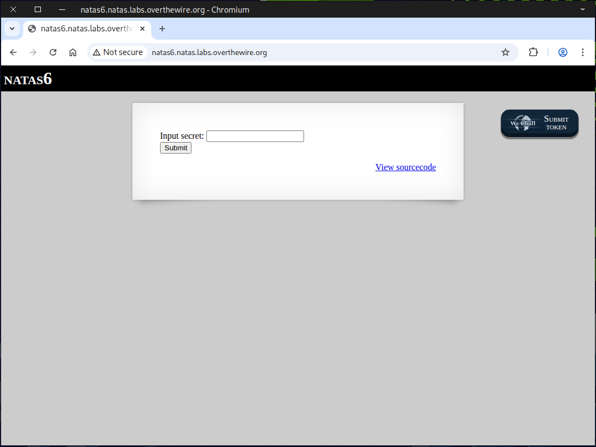
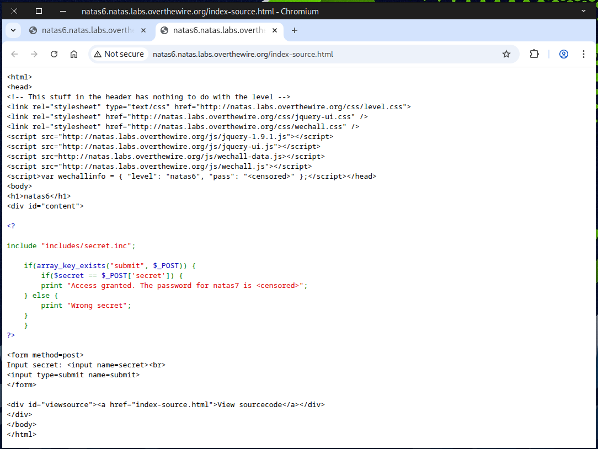
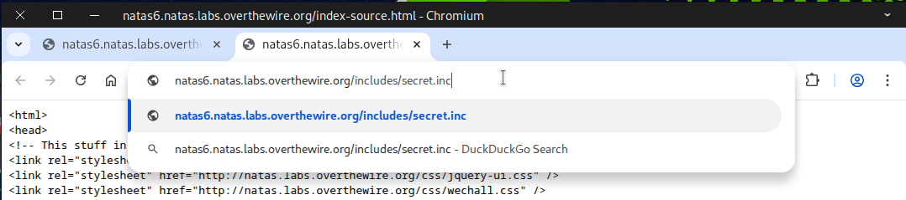
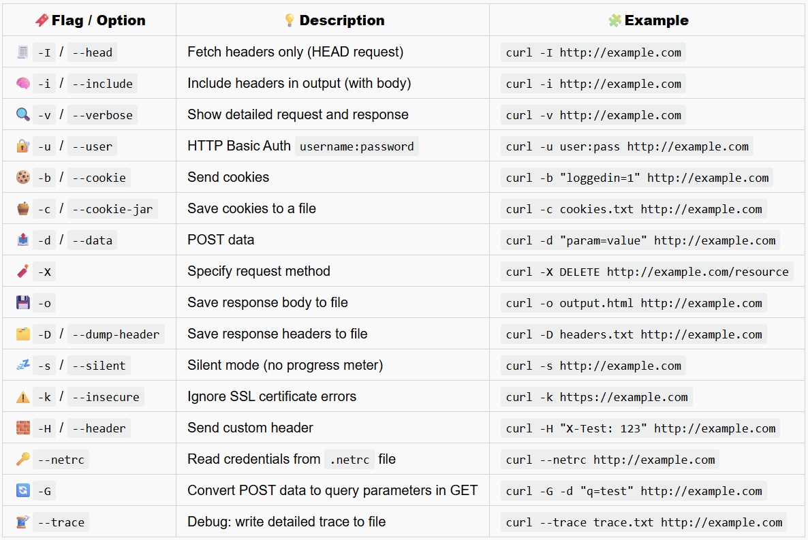
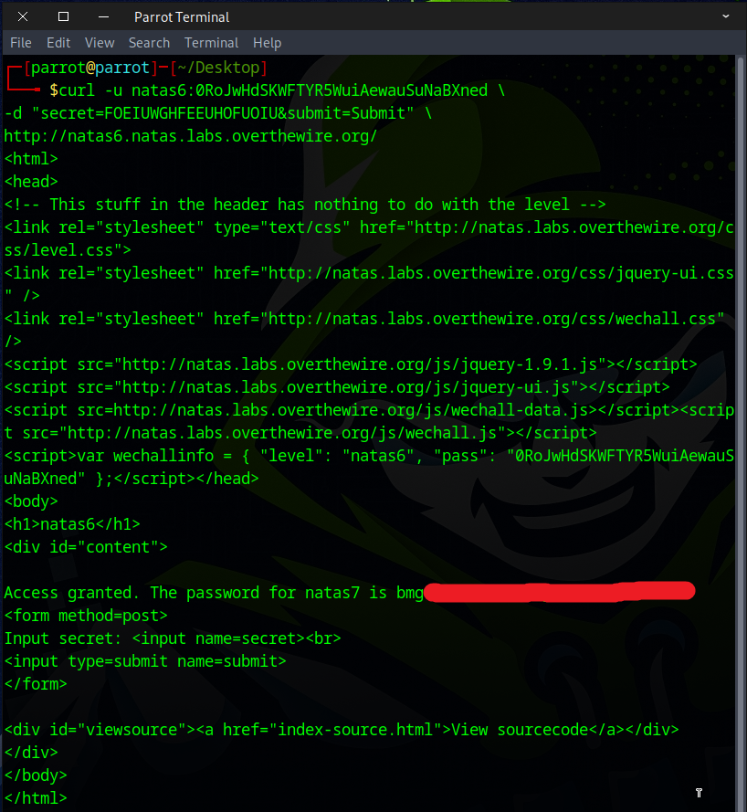
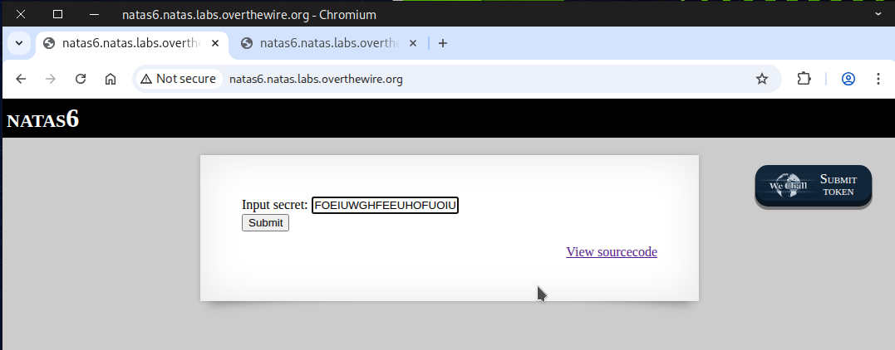
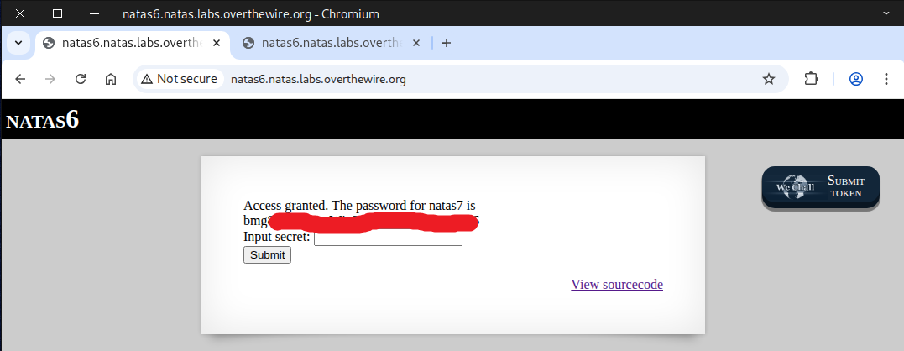

# 🕸️Natas Level 6 → Level 7

```
http://natas6.natas.labs.overthewire.org
```
Username: natas6  
Password: (natas6_password)



We start by looking at the source page to uncover potential clues.



The file `includes/secret.inc` caught our attention, so we decided to check it out.



We found the value of ``$secret`` and copied it.


### 🌀Useful curl command


```
curl -u natas6:0RoJwHdSKWFTYR5WuiAewauSuNaBXned \
-d "secret=FOEIUWGHFEEUHOFUOIU&submit=Submit" \
http://natas6.natas.labs.overthewire.org/
```
``-u user:pass`` — Supplies Basic Auth credentials.  
`-d` (short for ``--data``) sends the provided string as POST body data. When you use -d, curl sets the request method to POST automatically (unless overridden with -X).  
``URL`` — The target server/page.  



Alternatively, you can simply copy and paste `FOEIUWGHFEEUHOFUOIU` into the secret input box and click submit.



Following these steps, the flag should be displayed.



Excellent! Use this flag to proceed to the next round.


