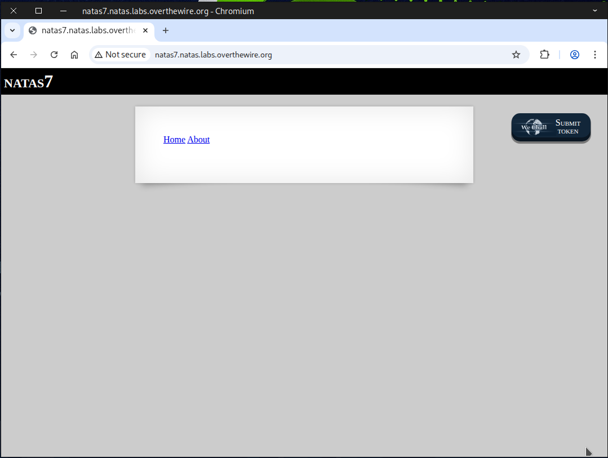
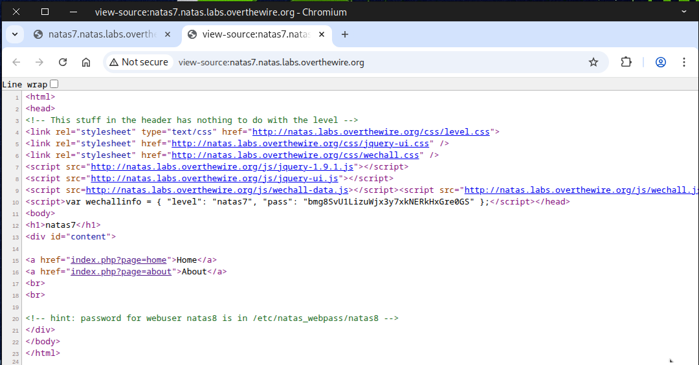
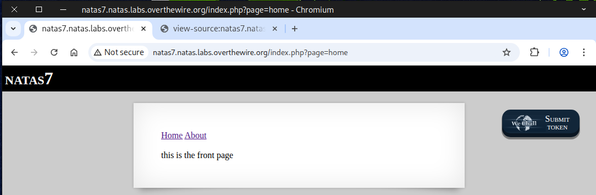
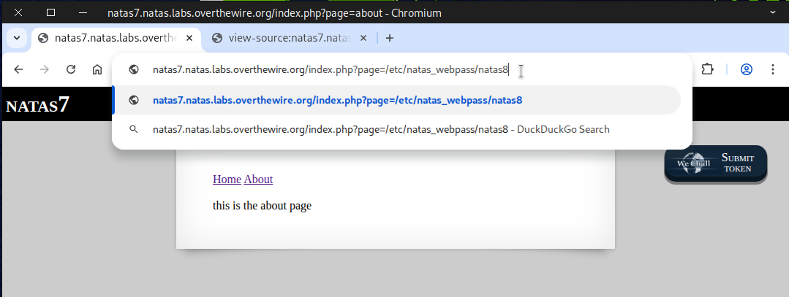
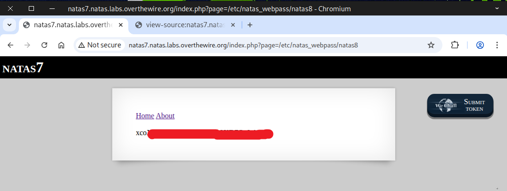
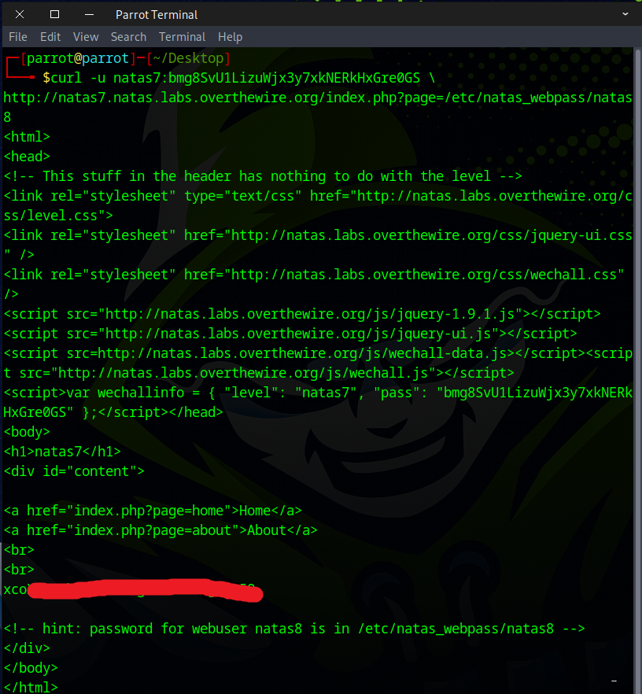

# 🕸️Natas Level 7 → Level 8

```
http://natas7.natas.labs.overthewire.org
```
Username: natas7  
Password: (natas7_password)



The clue indicates that the password for `natas8` is located at ``/etc/natas_webpass/natas8``.



Next, we click on the `Home` and `About` pages to see if anything interesting appears.



Noticing the URL pattern `index.php?page=home`, we begin some online research.


### What is a Local File Inclusion (LFI) attack?
A Local File Inclusion (LFI) attack happens when a website lets a user load or “include” files from the server, but doesn’t check or restrict what files can be loaded.

### Why is it dangerous?
- Read sensitive files
Attackers can see passwords, configuration files, or other private data stored on the server.
- Potential for code execution
If the attacker can find a way to include files with executable code, they could run commands on the server.
- Information leakage
Even if they don’t get full access, just knowing file paths or usernames can help an attacker plan further attacks.

Next, we replace `home` in the URL with ``/etc/natas_webpass/natas8`` and hit `enter`.



You should see the flag displayed.



For those who prefer the command line over a browser.
```
curl -u natas7:bmg8SvU1LizuWjx3y7xkNERkHxGre0GS \
http://natas7.natas.labs.overthewire.org/index.php?page=/etc/natas_webpass/natas8
```


You got the flag! Let’s see what the next challenge has in store.


