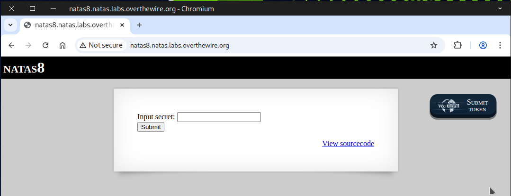
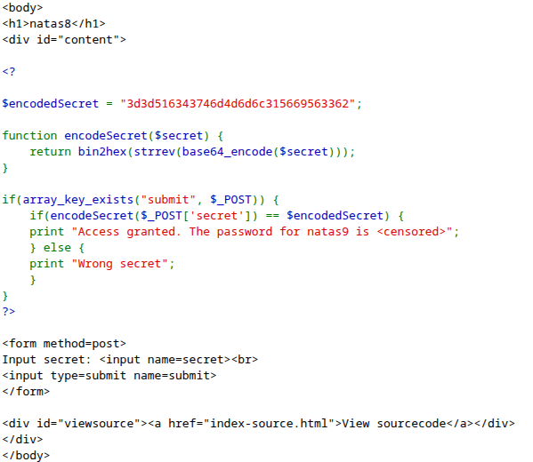
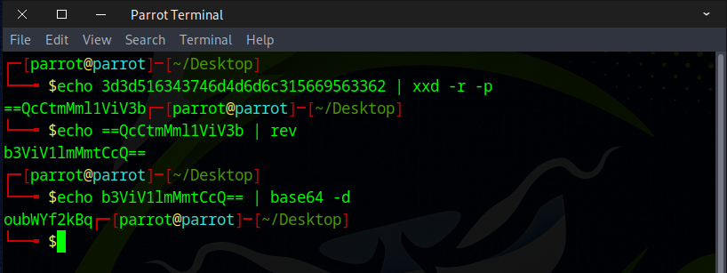
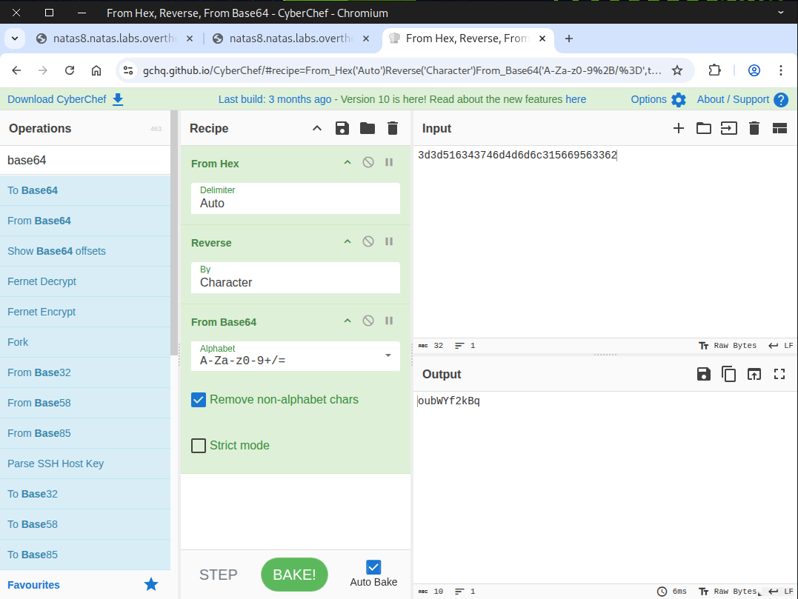
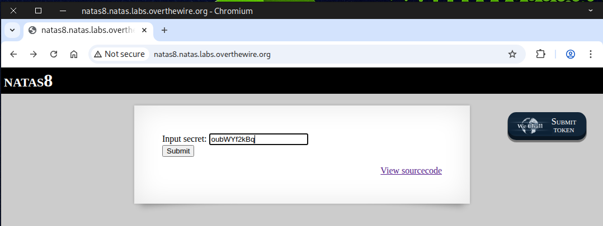
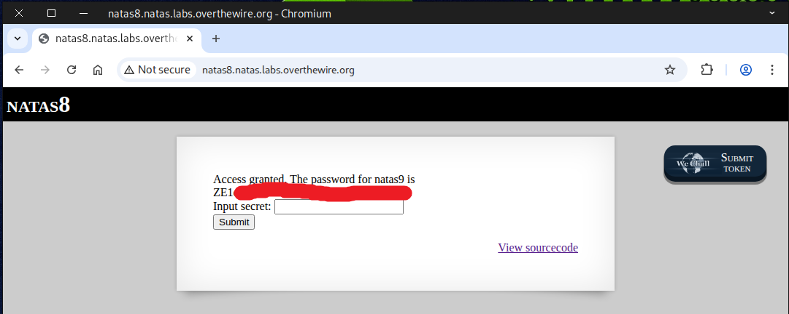
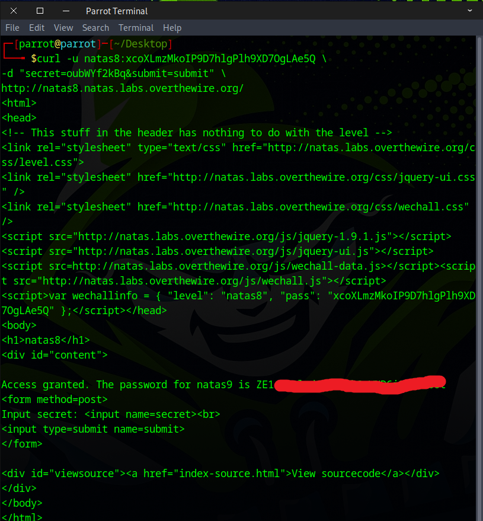

# 🕸️Natas Level 8 → Level 9

```
http://natas8.natas.labs.overthewire.org
```
Username: natas8  
Password: (natas8_password)



We check the page source for any clues and find ``$encodedSecret`` along with the `function` used to encrypt it, which is interesting.



Next, we attempt to decrypt it using the `xxd`, `rev`, and `base64` commands.



If you prefer using a one-liner instead of manually copying and pasting.
```
echo 3d3d516343746d4d6d6c315669563362 | xxd -r -p | rev | base64 -d
```
`xxd -r -p` — reads a plain hex stream and converts it to the raw bytes (hex → ASCII/binary).  
`rev` — Reverses the string (character order).  
`base64 -d` — Decodes the base64 string into its original bytes/text.  


Another approach is to leverage `CyberChef`, which is a fantastic tool for this purpose.



Next, copy and paste `oubWYf2kBq` into the secret input box and click submit.



Following these steps, the flag should be shown.



For those who favor the command line over a browser.
```
curl -u natas8:xcoXLmzMkoIP9D7hlgPlh9XD7OgLAe5Q \
-d "secret=oubWYf2kBq&submit=submit" \
http://natas8.natas.labs.overthewire.org/
```



Flag secured! Ready for the next challenge?


