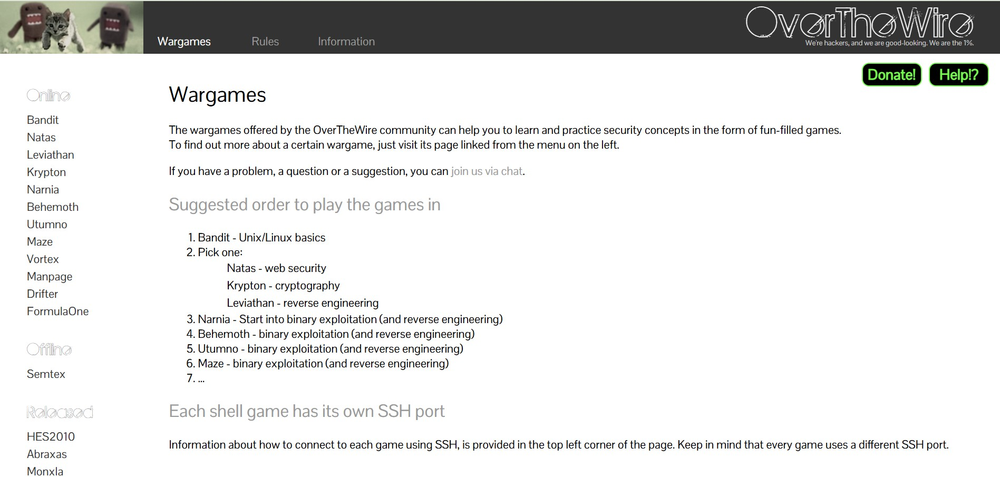

## 🔐 What is OverTheWire?

OverTheWire is a free, beginner-friendly platform where you can learn cybersecurity by playing games. It’s designed to teach you real-world hacking skills in a safe and legal way.

Instead of reading dry theory, you actually get hands-on experience by solving challenges on real servers.

## 🕹️ How Does It Work?

Each challenge (called a wargame) is like a level in a game. You connect to a remote machine using basic tools like SSH (a way to access another computer securely), and try to find the password to the next level.

You’ll learn things like:

- How to use the Linux command line

- File permissions

- Scripting

- Networking basics

- Common security loopholes

## Overthewire Bandit walkthrough

Bandit level 1  
Bandit level 2  
Bandit level 3  
Bandit level 4  
Bandit level 5  

