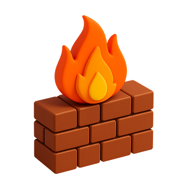

# Extending Your Network
Learn about some of the technologies used to extend networks out onto the Internet and the motivations for this.

### Task 1 Introduction to Port Forwarding

What is the name of the device that is used to configure port forwarding?
```
✅ router
```
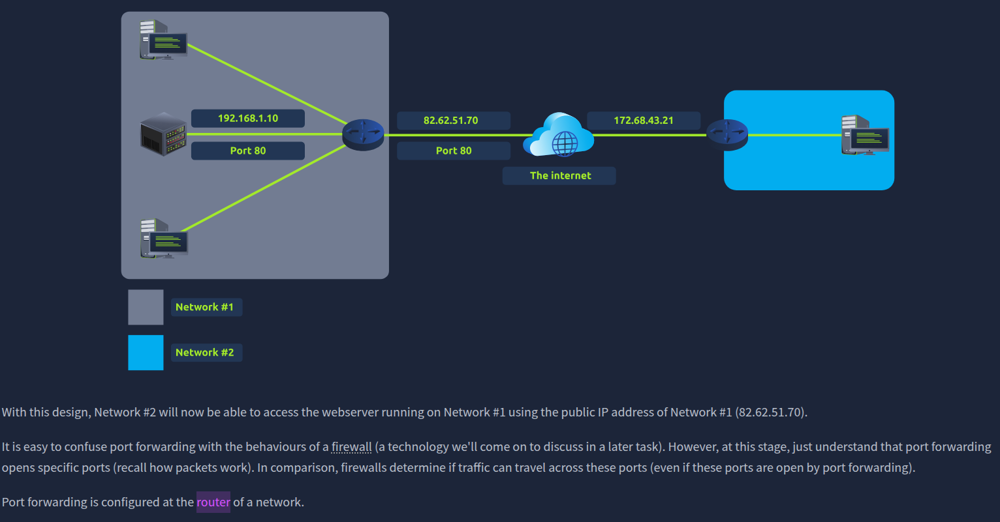

### Task 2 Firewalls 101

What layers of the OSI model do firewalls operate at?

For this answer, just provide the numbers in ascending order, separated by an ampersand (&) I.e: 4 & 5
```
✅ 3 & 4
```
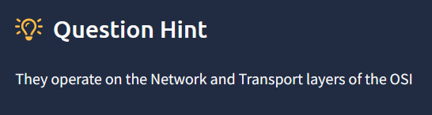

What category of firewall inspects the entire connection?
```
✅ stateful
```

What category of firewall inspects individual packets?
```
✅ stateless
```
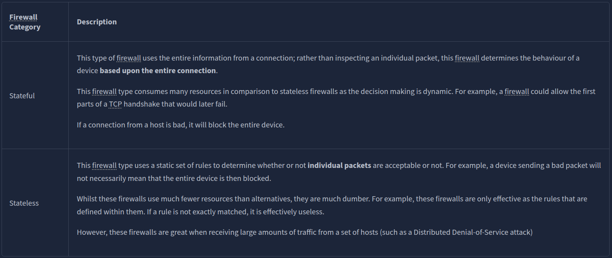

### Task 3 Practical - Firewall

What is the flag?
```
✅ THM{FIREWALLS_RULE}
```
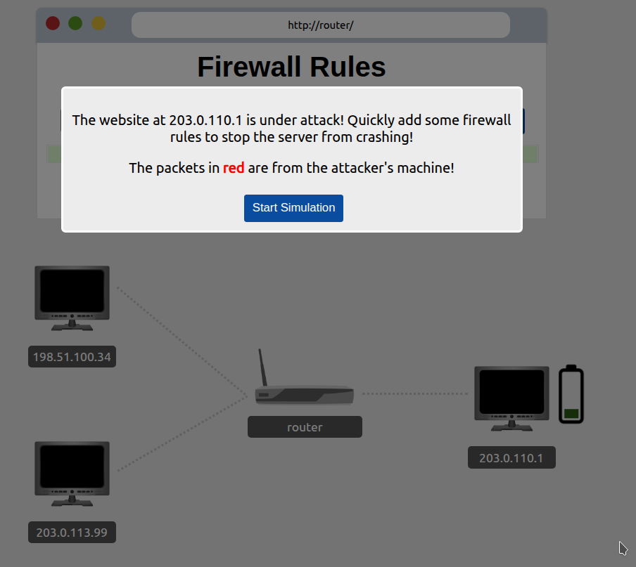

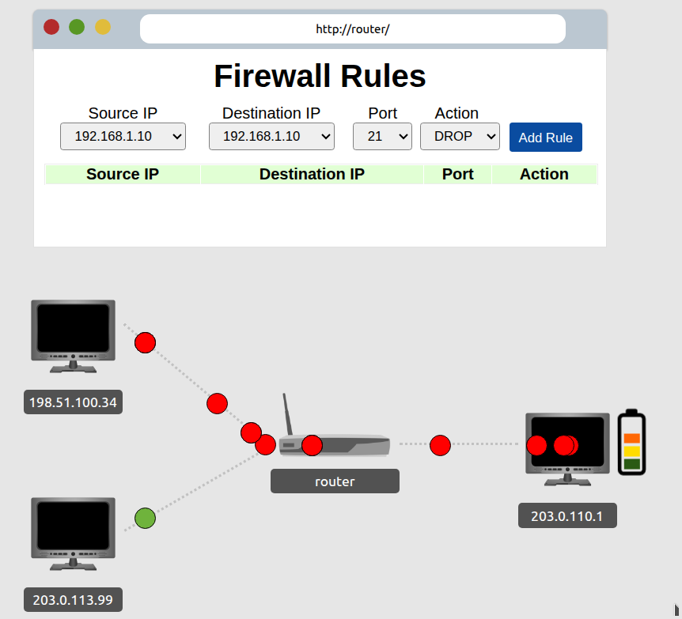

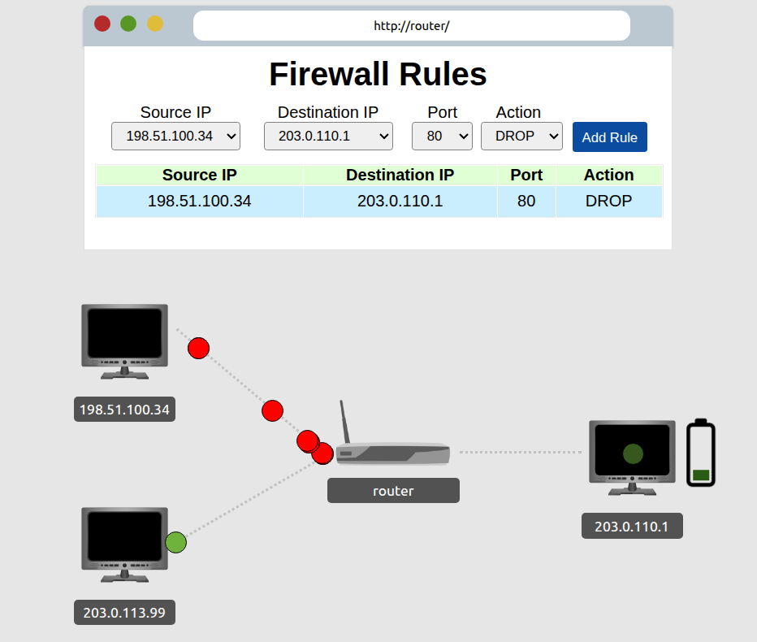

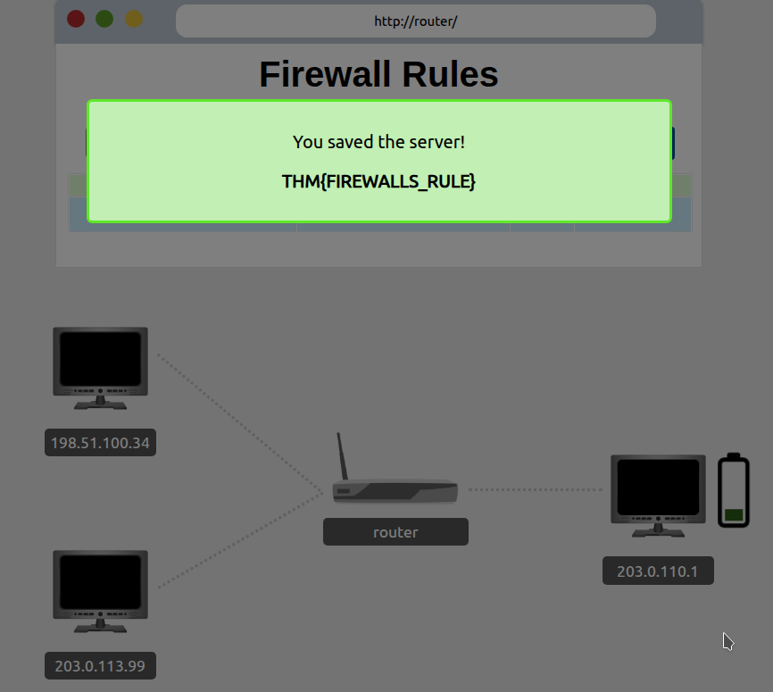

### Task 4 VPN Basics

What VPN technology only encrypts & provides the authentication of data?
```
✅ PPP
```

What VPN technology uses the IP framework?
```
✅ IPSec
```
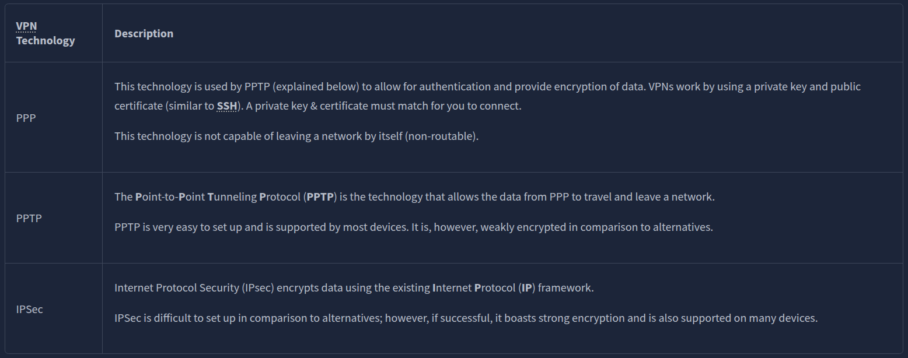

### Task 5 LAN Networking Devices

What is the verb for the action that a router does?
```
✅ routing
```
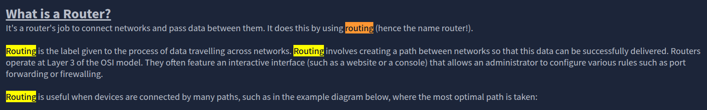

What are the two different layers of switches? Separate these by a comma I.e.: Layer X,Layer Y
```
✅ Layer 2,Layer 3
```


### Task 6 Practical - Network Simulator

What is the flag from the network simulator?
```
✅ THM{YOU'VE_GOT_DATA}
```
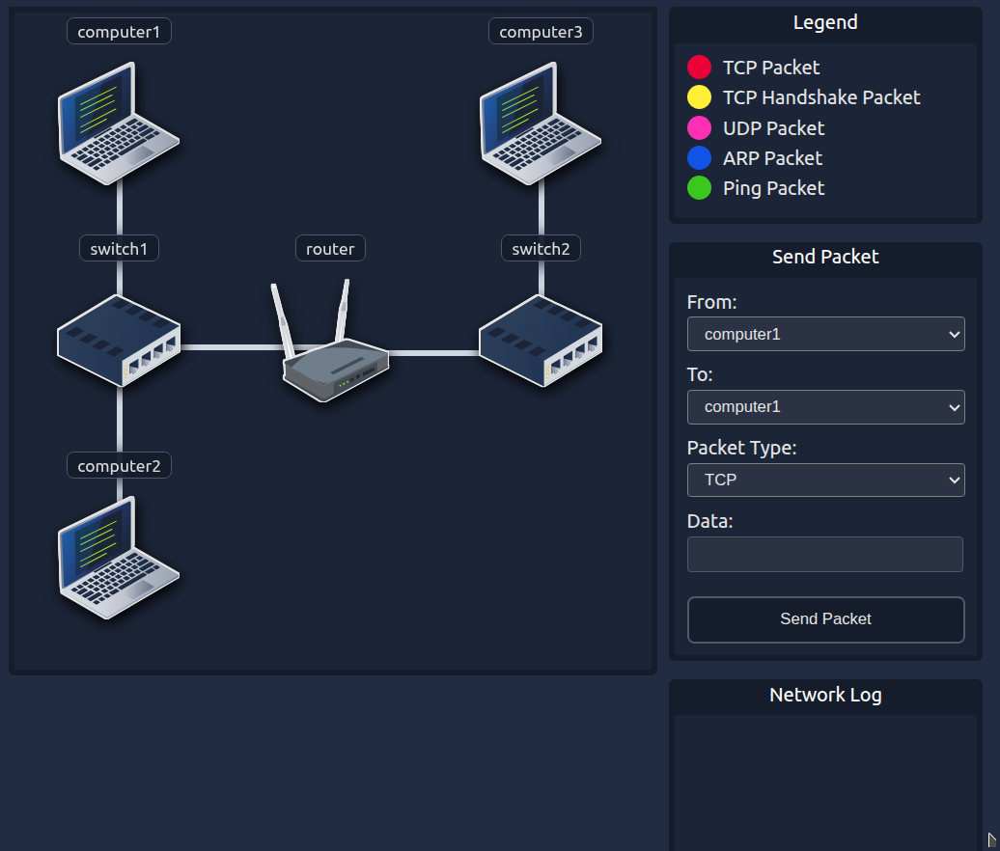

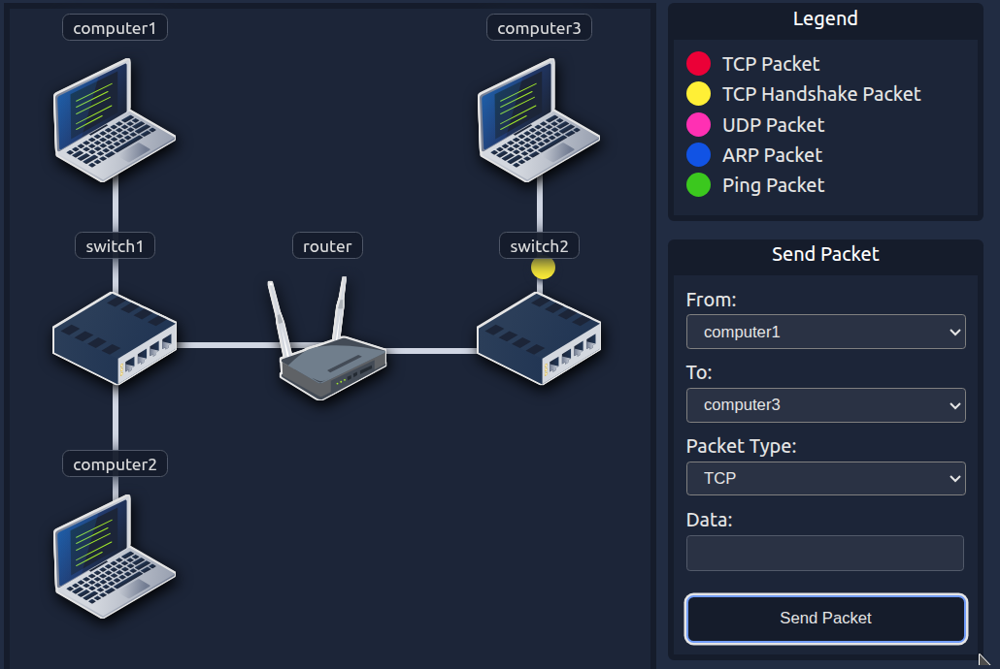

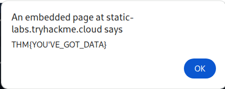

How many HANDSHAKE entries are there in the Network Log?
```
✅ 5
```

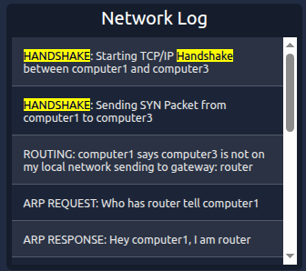

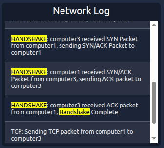

