# How Websites Work
To exploit a website, you first need to know how they are created.

### Task 1 How websites work

What term best describes the component of a web application rendered by your browser?
```
✅ Front End
```
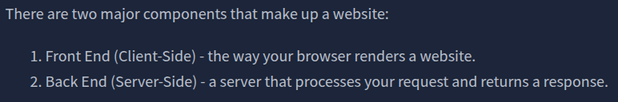

### Task 2 HTML

Let's play with some HTML! First click the "View Site" button inside this task. On the right-hand side, you should see a box that renders HTML - If you enter some HTML into the box and click the green "Render HTML Code" button, it will render your HTML on the page; you should see an image of some cats.
```
✅ No answer needed
```

One of the images on the cat website is broken - fix it, and the image will reveal the hidden text answer!
```
✅ HTMLHERO
```
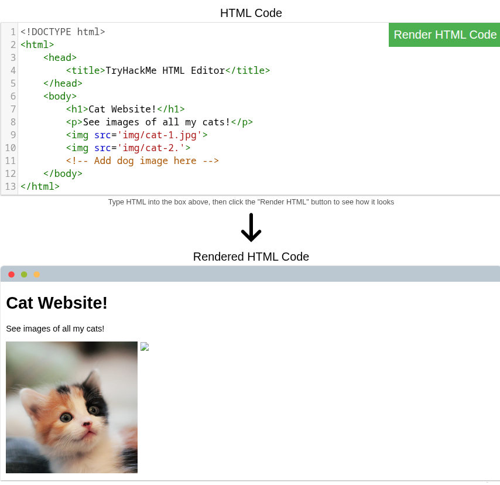
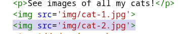
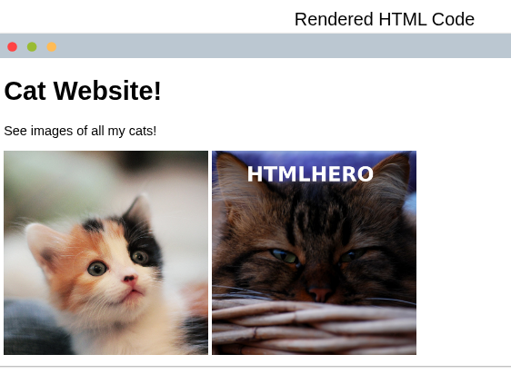

Add a dog image to the page by adding another img tag () on line 11. The dog image location is img/dog-1.png. What is the text in the dog image?
```
✅ DOGHTML
```

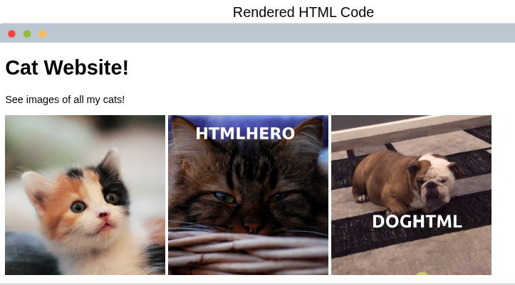

### Task 3 JavaScript

Click the "View Site" button on this task. On the right-hand side, add JavaScript that changes the demo element's content to "Hack the Planet"
```
✅ JSISFUN
```
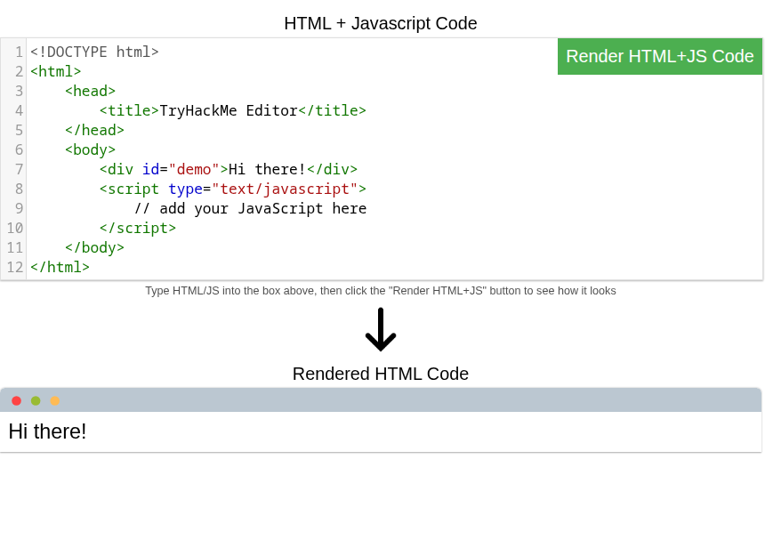
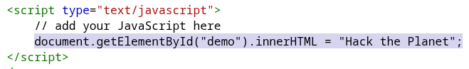
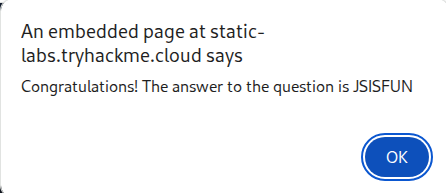

Add the button HTML from this task that changes the element's text to "Button Clicked" on the editor on the right, update the code by clicking the "Render HTML+JS Code" button and then click the button.
```
✅ No answer needed
```
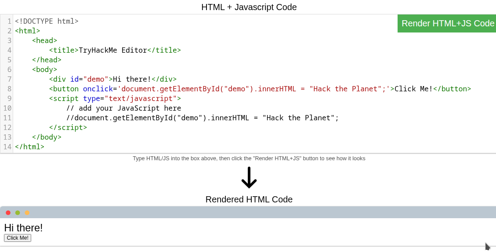

### Task 4 Sensitive Data Exposure

View the website on this link. What is the password hidden in the source code?
```
✅ testpasswd
```
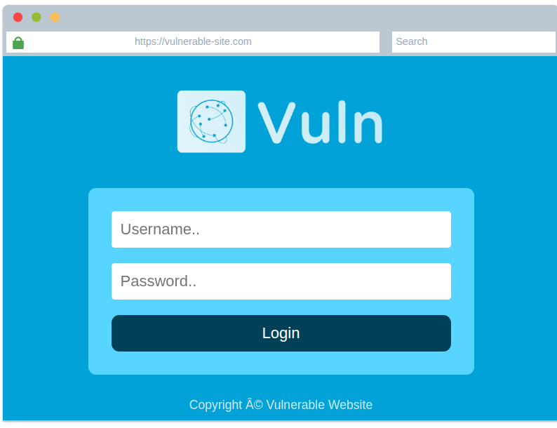

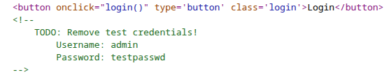
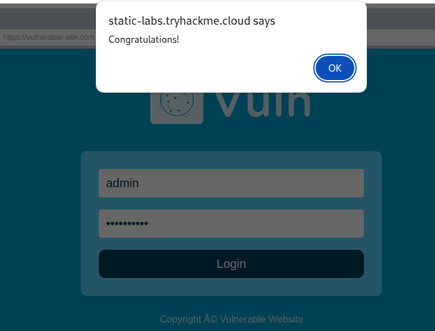

### Task 5 HTML Injection

View the website on this task and inject HTML so that a malicious link to http://hacker.com is shown.
```
✅ HTML_INJ3CTI0N
```
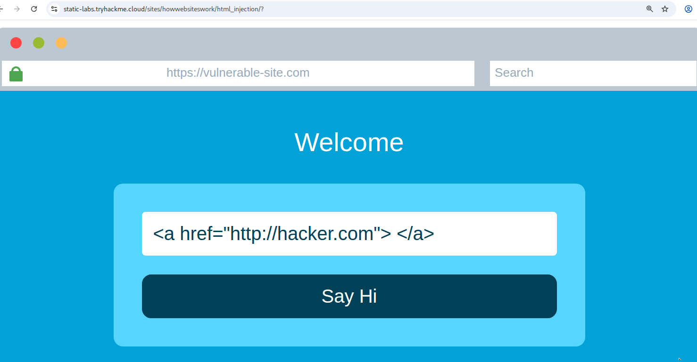
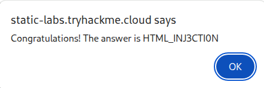


