# HTTP in Detail
Learn about how you request content from a web server using the HTTP protocol

### Task 1 What is HTTP(S)?

What does HTTP stand for?
```
✅ HyperText Transfer Protocol
```

What does the S in HTTPS stand for?
```
✅ secure
```
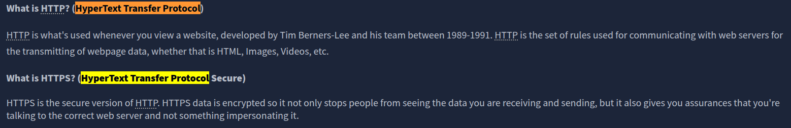

On the mock webpage on the right there is an issue, once you've found it, click on it. What is the challenge flag?
```
✅ THM{INVALID_HTTP_CERT}
```
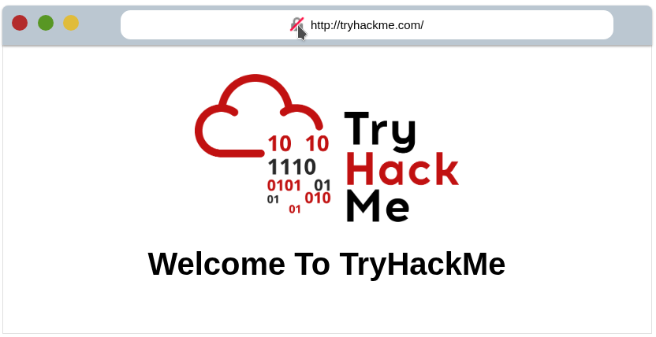
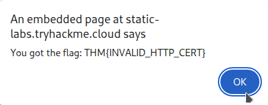

### Task 2 Requests And Responses

What HTTP protocol is being used in the above example?
```
✅ HTTP/1.1
```

What response header tells the browser how much data to expect?
```
✅ Content-Length
```
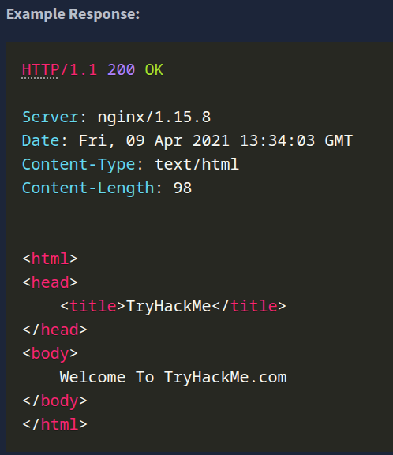

### Task 3 HTTP Methods

What method would be used to create a new user account?
```
✅ POST
```

What method would be used to update your email address?
```
✅ PUT
```

What method would be used to remove a picture you've uploaded to your account?
```
✅ DELETE
```

What method would be used to view a news article?
```
✅ GET
```
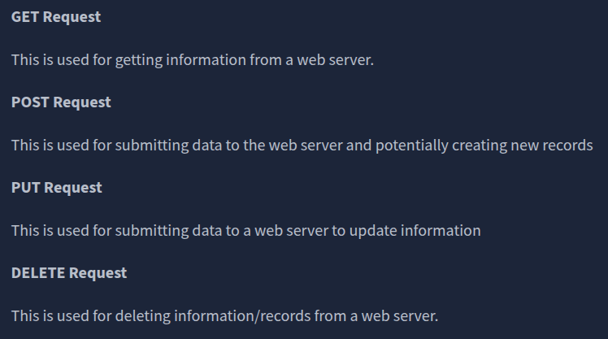

### Task 4 HTTP Status Codes

What response code might you receive if you've created a new user or blog post article?
```
✅ 201
```

What response code might you receive if you've tried to access a page that doesn't exist?
```
✅ 404
```

What response code might you receive if the web server cannot access its database and the application crashes?
```
✅ 503
```

What response code might you receive if you try to edit your profile without logging in first?
```
✅ 401
```
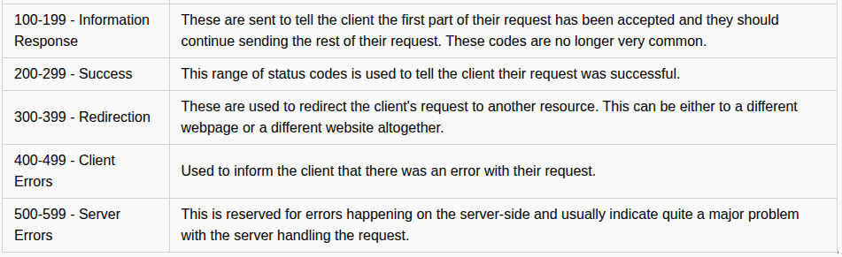
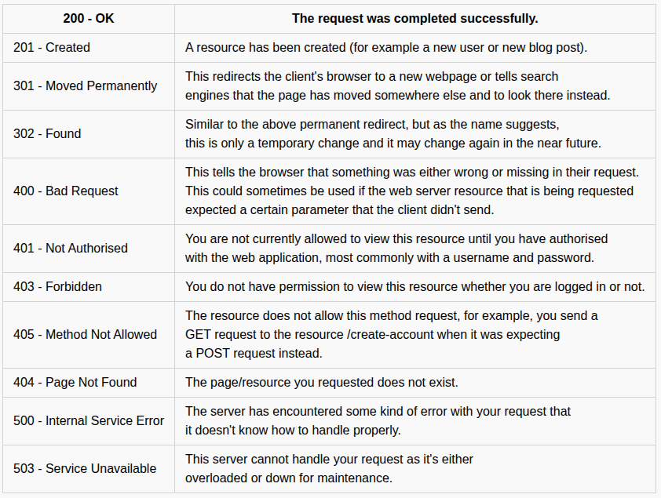

### Task 5 Headers

What header tells the web server what browser is being used?
```
✅ User-Agent
```
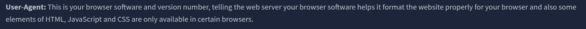

What header tells the browser what type of data is being returned?
```
✅ Content-Type
```
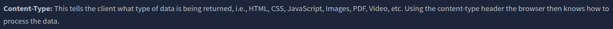

What header tells the web server which website is being requested?
```
✅ Host
```


### Task 6 Cookies

Which header is used to save cookies to your computer?
```
✅ Set-Cookie
```


### Task 7 Making Requests

Make a GET request to /room page
```
✅ THM{YOU'RE_IN_THE_ROOM}
```
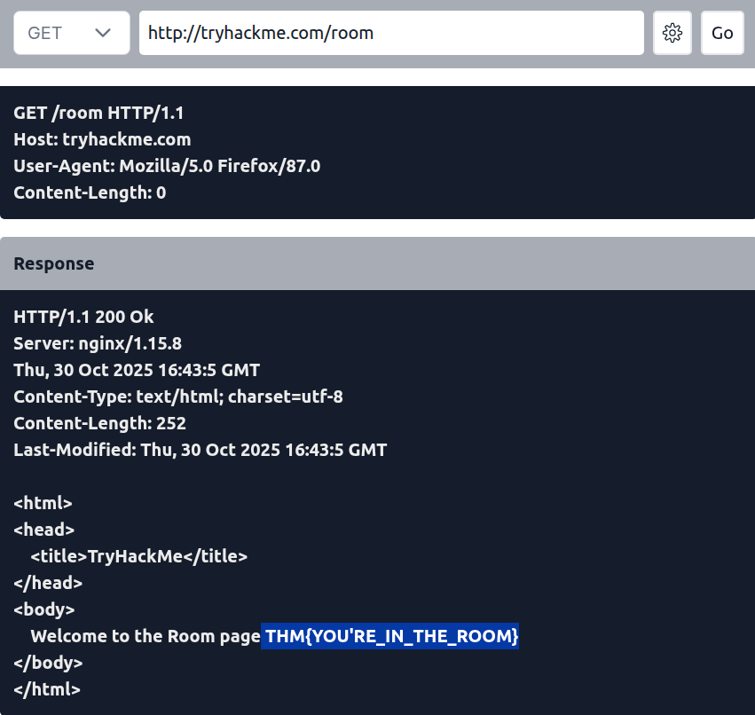

Make a GET request to /blog page and set the id parameter to 1
Note: Use the gear button on the right to manage URI parameters
```
✅ THM{YOU_FOUND_THE_BLOG}
```
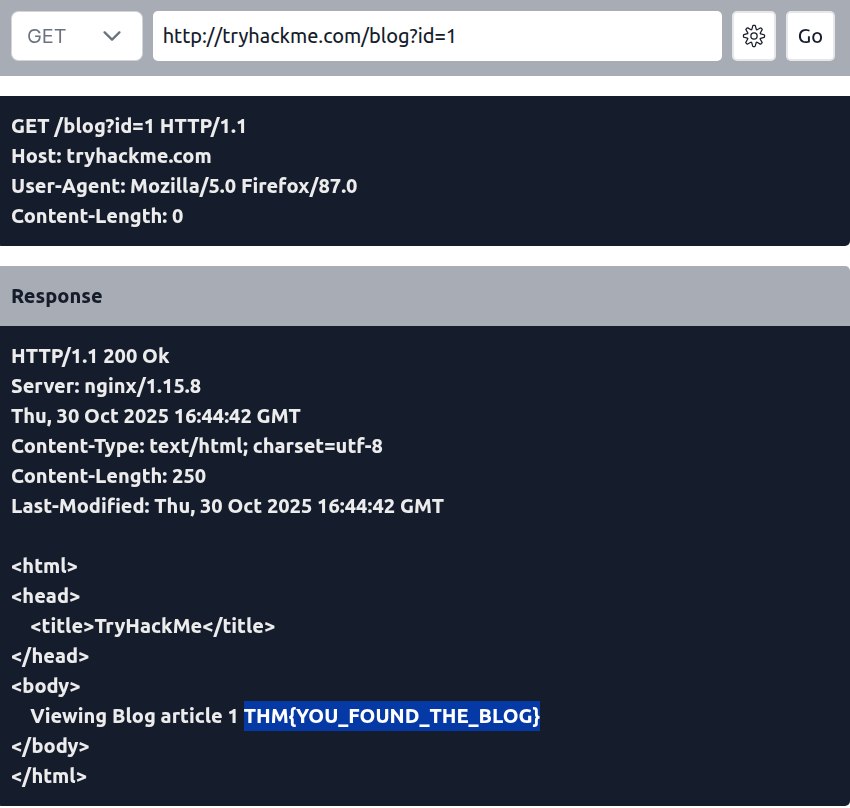

Make a DELETE request to /user/1 page
```
✅ THM{USER_IS_DELETED}
```
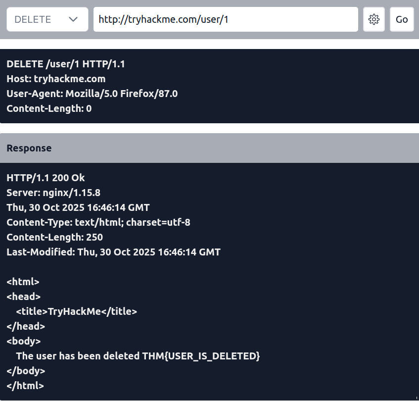

Make a PUT request to /user/2 page with the username parameter set to admin
Note: Use the gear button on the right to manage body parameters
```
✅ THM{USER_HAS_UPDATED}
```
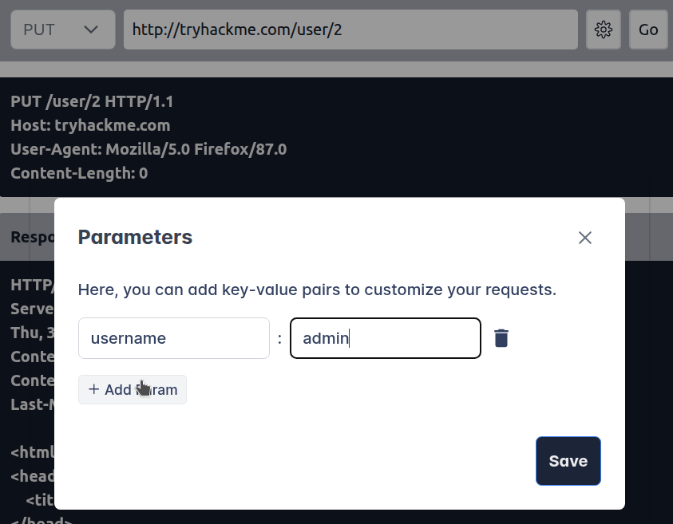
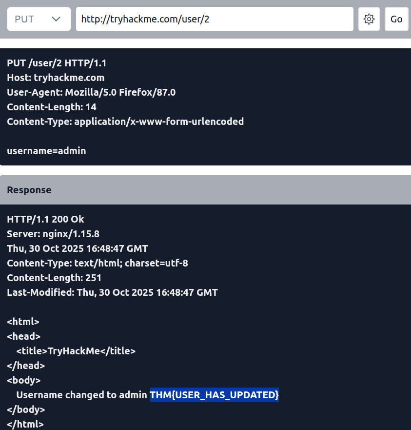

Make a POST request to /login page with the username of thm and a password of letmein
Note: Use the gear button on the right to manage body parameters
```
✅ THM{HTTP_REQUEST_MASTER}
```
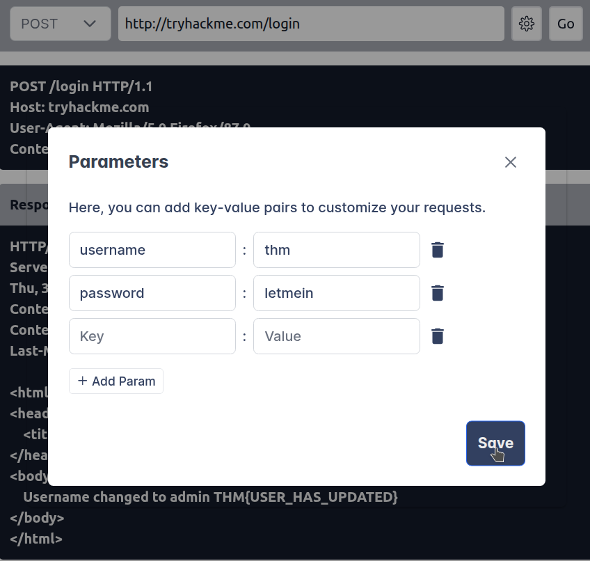
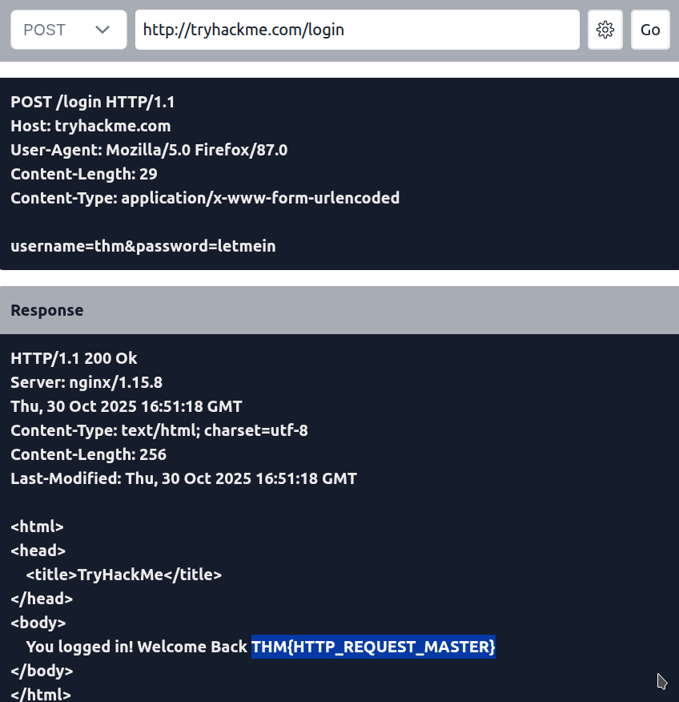


