# Intro to LAN
Learn about some of the technologies and designs that power private networks

### Task 1 Introducing LAN Topologies

What does LAN stand for?
```
✅ Local Area Network
```


What is the verb given to the job that Routers perform?
```
✅ Routing
```
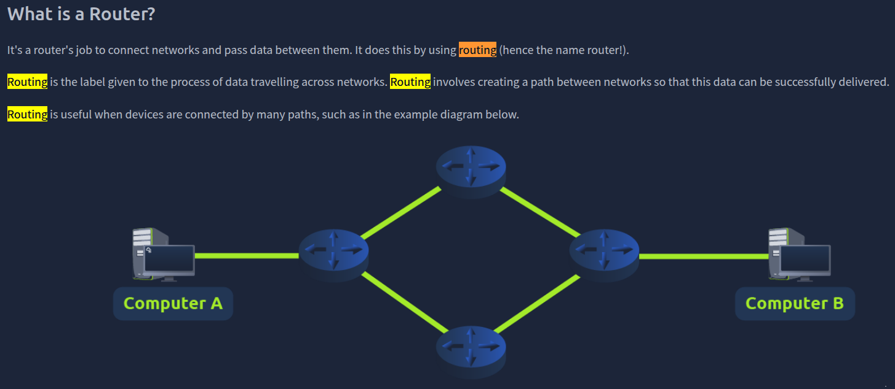

What device is used to centrally connect multiple devices on the local network and transmit data to the correct location?
```
✅ Switch
```
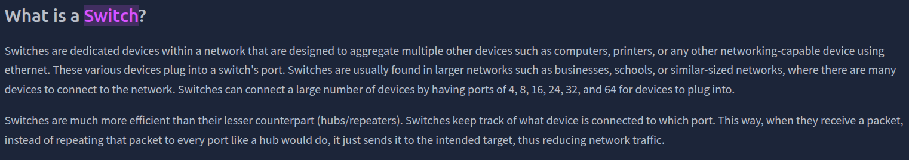

What topology is cost-efficient to set up?
```
✅ Bus Topology
```
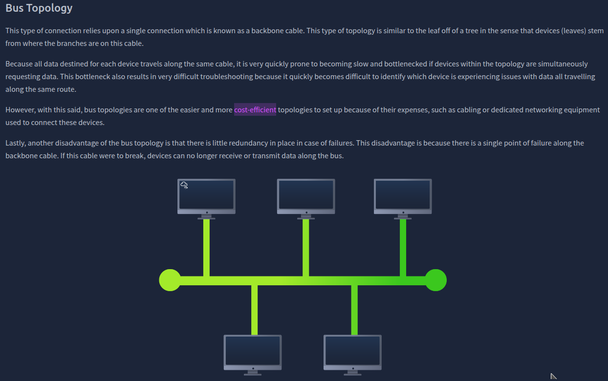

What topology is expensive to set up and maintain?
```
✅ Star Topology
```
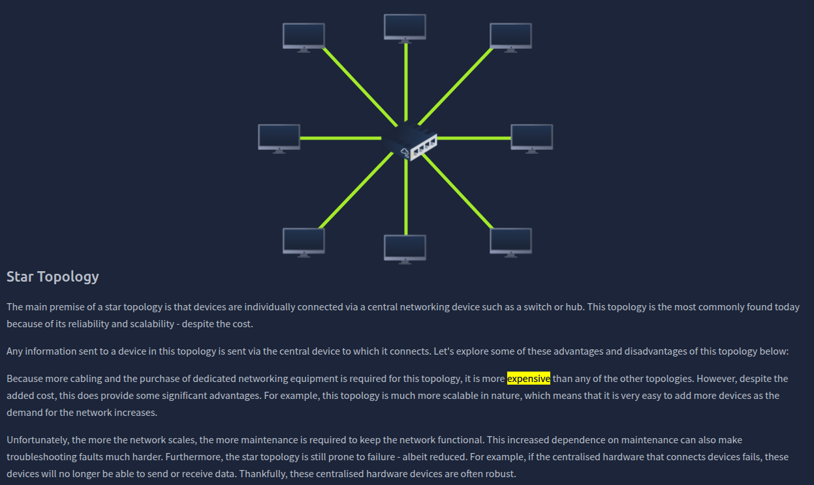

Complete the interactive lab attached to this task. What is the flag given at the end?
```
✅ THM{TOPOLOGY_FLAWS}
```
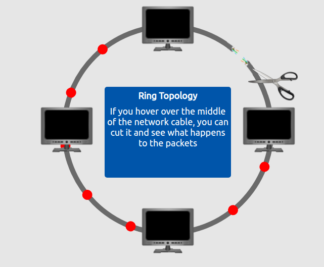

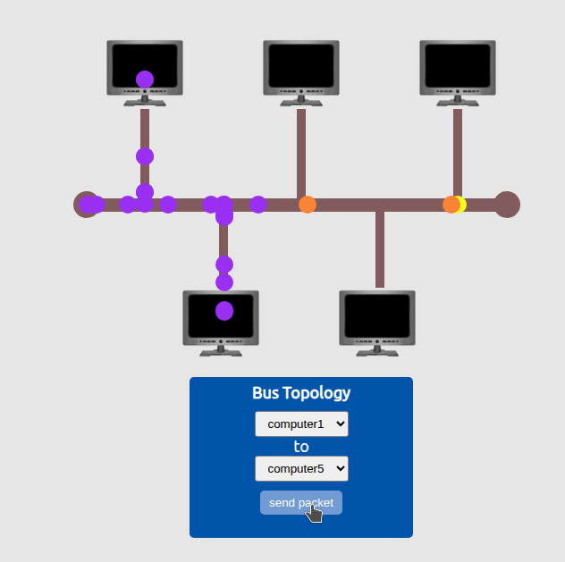

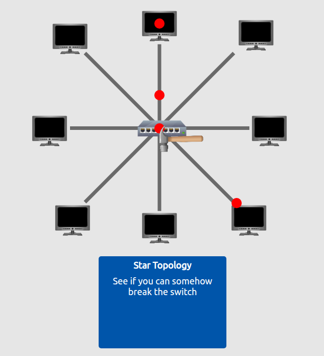

### Task 2 A Primer on Subnetting

What is the technical term for dividing a network up into smaller pieces?
```
✅ Subnetting
```
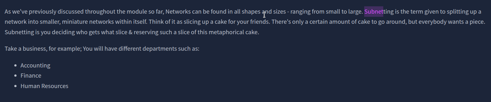

How many bits are in a subnet mask?
```
✅ 32
```

What is the range of a section (octet) of a subnet mask?
```
✅ 0-255
```
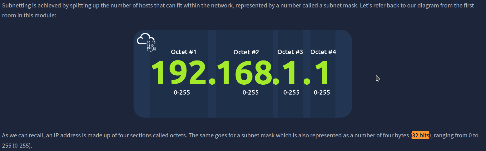

What address is used to identify the start of a network?
```
✅ Network Address
```

What address is used to identify devices within a network?
```
✅ Host Address
```

What is the name used to identify the device responsible for sending data to another network?
```
✅ Default Gateway
```
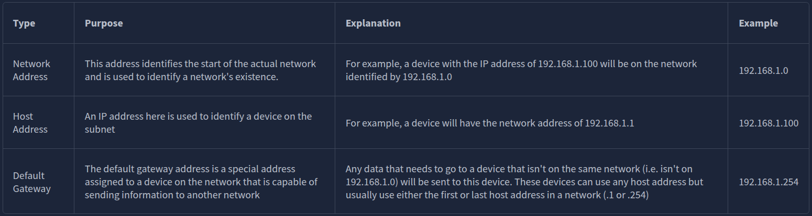


### Task 3 ARP

What does ARP stand for?
```
✅ Address Resolution Protocol
```
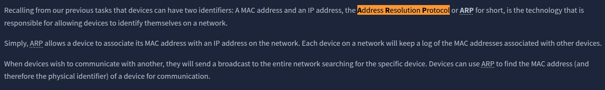

What category of ARP Packet asks a device whether or not it has a specific IP address?
```
✅ Request
```

What address is used as a physical identifier for a device on a network?
```
✅ MAC Address
```

What address is used as a logical identifier for a device on a network?
```
✅ IP Address
```


### Task 4 DHCP

What type of DHCP packet is used by a device to retrieve an IP address?
```
✅ DHCP Discover
```

What type of DHCP packet does a device send once it has been offered an IP address by the DHCP server?
```
✅ DHCP Request
```

Finally, what is the last DHCP packet that is sent to a device from a DHCP server?
```
✅ DHCP ACK
```
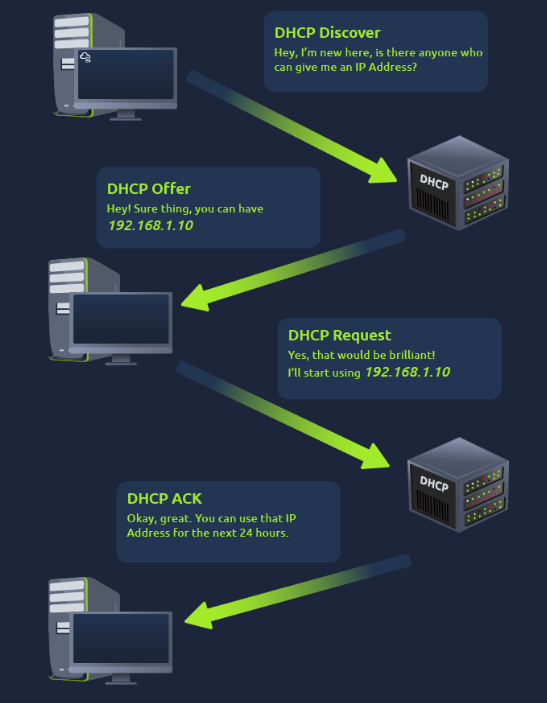

### Task 5 Continue Your Learning: OSI Model

Join the "OSI Model" room.
```
✅ No answer needed
```