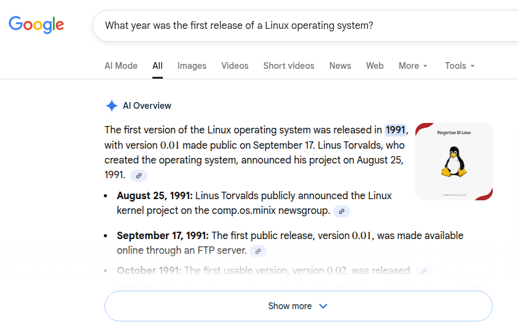
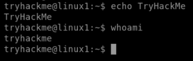
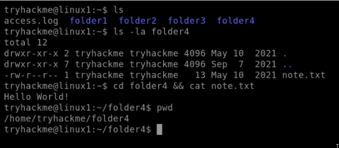
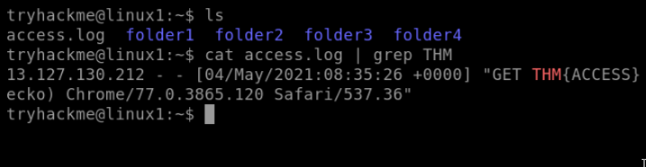
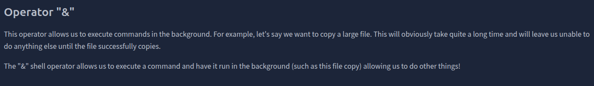
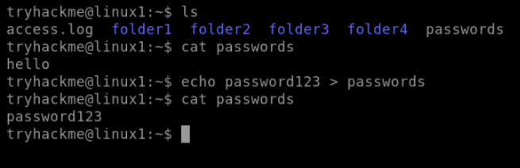
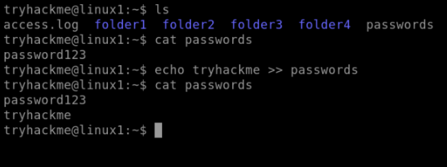

# Linux Fundamentals Part 1
Embark on the journey of learning the fundamentals of Linux. Learn to run some of the first essential commands on an interactive terminal.


### Task 1 Introduction

```
✅ No answer needed
```

### Task 2 A Bit of Background on Linux

Research: What year was the first release of a Linux operating system?
```
✅ 1991
```


### Task 3 Interacting With Your First Linux Machine (In-Browser)

```
✅ No answer needed
```

### Task 4 Running Your First few Commands

If we wanted to output the text "TryHackMe", what would our command be?
```
✅ echo TryHackMe
```

What is the username of who you're logged in as on your deployed Linux machine?
```
✅ tryhackme
```


### Task 5 Interacting With the Filesystem!

On the Linux machine that you deploy, how many folders are there?
```
✅ 4
```

Which directory contains a file? 
```
✅ folder4
```

What is the contents of this file?
```
✅ Hello World
```

Use the cd command to navigate to this file and find out the new current working directory. What is the path?
```
✅ /home/tryhackme/folder4
```


### Task 6 Searching for Files

Use grep on "access.log" to find the flag that has a prefix of "THM". What is the flag? Note: The "access.log" file is located in the "/home/tryhackme/" directory.
```
✅ THM{ACCESS}
```


And I still haven't found what I'm looking for!
```
✅ No answer needed
```

### Task 7 An Introduction to Shell Operators

If we wanted to run a command in the background, what operator would we want to use?
```
✅ &
```


If I wanted to replace the contents of a file named "passwords" with the word "password123", what would my command be?
```
✅ echo password123 > passwords
```


Now if I wanted to add "tryhackme" to this file named "passwords" but also keep "passwords123", what would my command be
```
✅ echo tryhackme >> passwords
```



Now use the deployed Linux machine to put these into practice
```
✅ No answer needed
```

### Task 8 Conclusions & Summaries

I'll have a play around!
```
✅ No answer needed
```

### Task 9

Terminate the machine deployed in this room from task 3. 
```
✅ No answer needed
```

Join Linux Fundamentals Part 2!
```
✅ No answer needed
```


