# Linux Fundamentals Part 2
Continue your learning Linux journey with part two. You will be learning how to log in to a Linux machine using SSH, how to advance your commands, file system interaction.

### Task 1 Introduction

Let's proceed!
```
✅ No answer needed
```

### Task 2 Accessing Your Linux Machine Using SSH (Deploy)

I've logged into the Linux Fundamentals Part 2 machine using SSH!
```
✅ No answer needed
```

### Task 3 Introduction to Flags and Switches

Explore the manual page of the ls command
```
✅ No answer needed
```

What directional arrow key would we use to navigate down the manual page?
```
✅ down
```

What flag would we use to display the output in a "human-readable" way?
```
✅ -h
```
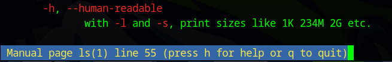

### Task 4 Filesystem Interaction Continued

How would you create the file named "newnote"?
```
✅ touch newnote
```
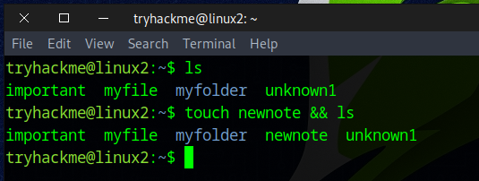

On the deployable machine, what is the file type of "unknown1" in "tryhackme's" home directory?
```
✅ ASCII text
```
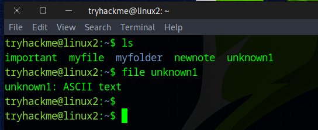

How would we move the file "myfile" to the directory "myfolder" 
```
✅ mv myfile myfolder
```
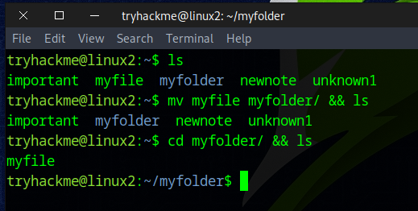

What are the contents of this file?
```
✅ THM{FILESYSTEM}
```
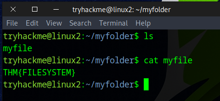

Continue to apply your knowledge and practice the commands from this task.
```
✅ No answer needed
```

### Task 5 Permissions 101

On the deployable machine, who is the owner of "important"?
```
✅ user2
```
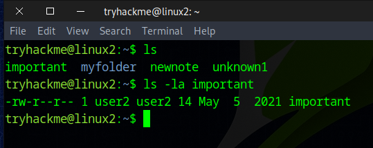

What would the command be to switch to the user "user2"?
```
✅ su user2
```
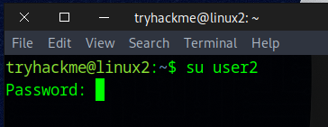

Now switch to this user "user2" using the password "user2"
```
✅ No answer needed
```

Output the contents of "important", what is the flag?
```
✅ THM{SU_USER2}
```
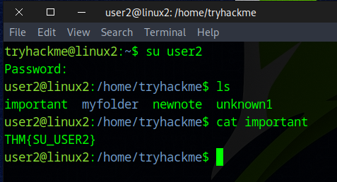

### Task 6 Common Directories

Read me!
```
✅ No answer needed
```

What is the directory path that would we expect logs to be stored in?
```
✅ /var/log
```
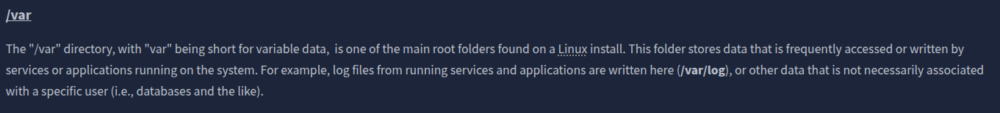

What root directory is similar to how RAM on a computer works?
```
✅ /tmp
```
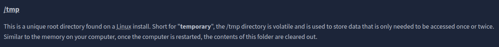

Name the home directory of the root user 
```
✅ /root
```
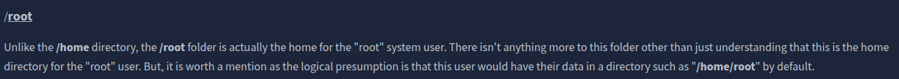

Now apply your learning and navigate through these directories on the deployed Linux machine.
```
✅ No answer needed
```

### Task 7 Conclusions and Summaries

Proceed to the next task to continue your learning
```
✅  No answer needed
```

### Task 8 Linux Fundamentals Part 3

Terminate the machine from task 2!
```
✅  No answer needed
```

Join Linux Fundamentals Part 3!
```
✅  No answer needed
```

