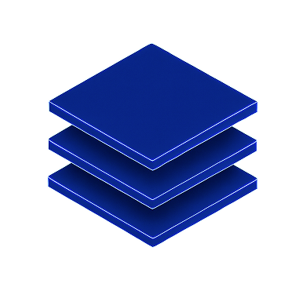

# OSI Model
Learn about the fundamental networking framework that determines the various stages in which data is handled across a network


### Task 1 What is the OSI Model?

What does the "OSI" in "OSI Model" stand for?
```
✅ Open Systems Interconnection
```
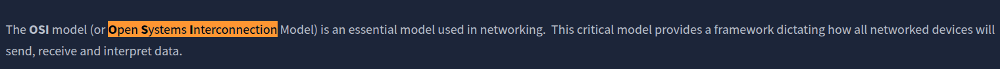

How many layers (in digits) does the OSI model have?
```
✅ 7
```
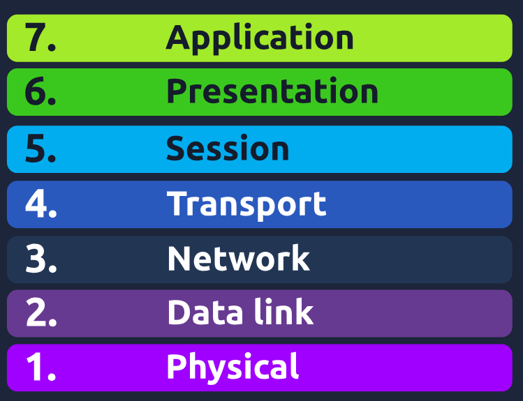

What is the key term for when pieces of information get added to data?
```
✅ encapsulation
```
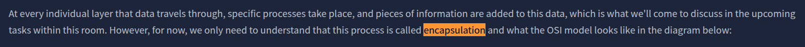

### Task 2 Layer 1 - Physical

What is the name of this Layer?
```
✅ Physical
```

What is the name of the numbering system that is both 0's and 1's?
```
✅ Binary
```

What is the name of the cables that are used to connect devices?
```
✅ Ethernet Cables
```
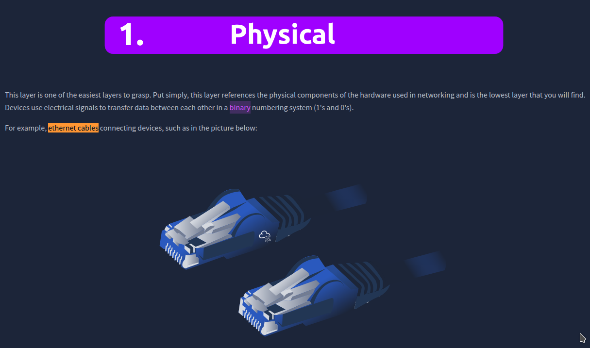


### Task 3 Layer 2 - Data Link

What is the name of this Layer?
```
✅ Data Link
```

What is the name of the piece of hardware that all networked devices come with?
```
✅ Network Interface Card
```
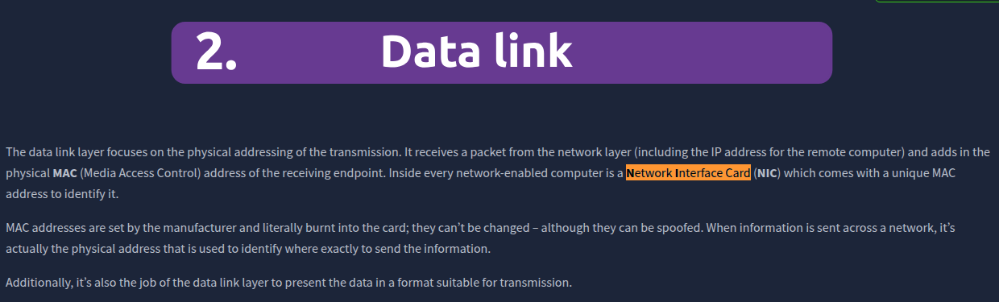

### Task 4 Layer 3 - Network 

What is the name of this Layer?
```
✅ Network
```

Will packets take the most optimal route across a network? (Y/N)
```
✅ Y
```

What does the acronym "OSPF" stand for?
```
✅ Open Shortest Path First
```

What does the acronym "RIP" stand for?
```
✅ Routing Information Protocol
```

What type of addresses are dealt with at this layer?
```
✅ IP Addresses
```
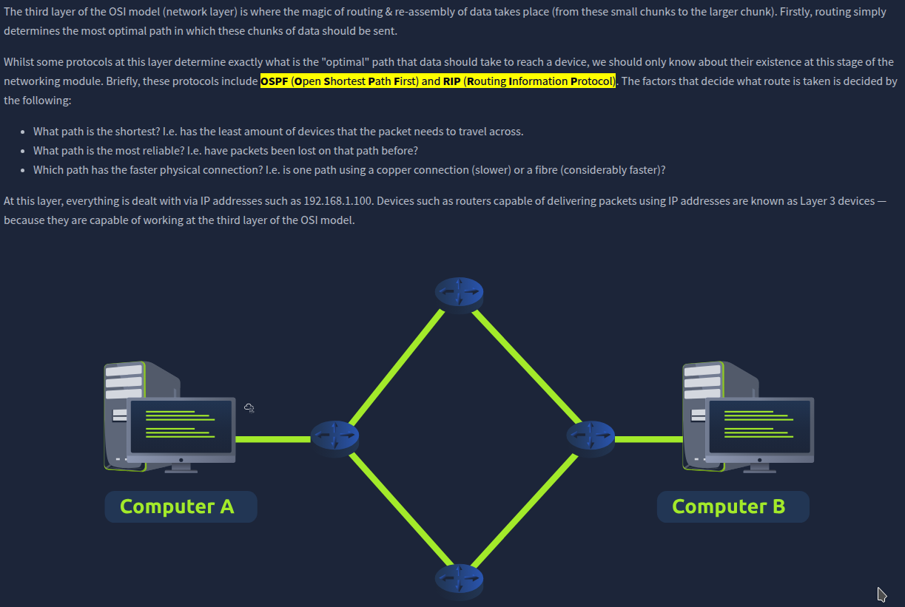

### Task 5 Layer 4 - Transport 

What is the name of this Layer?
```
✅ Transport
```

What does TCP stand for?
```
✅ Transmission Control Protocol
```
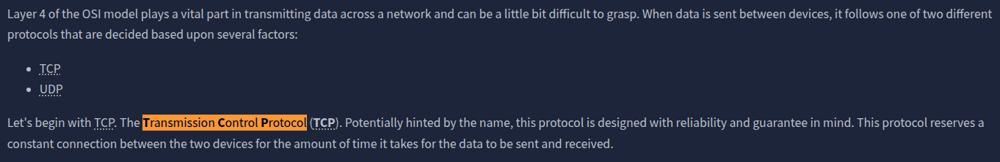

What does UDP stand for?
```
✅ User Datagram Protocol
```
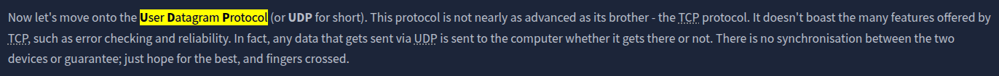

What protocol guarantees the accuracy of data?
```
✅ TCP
```

What protocol doesn't care if data is received or not by the other device?
``` 
✅ UDP
```

What protocol would an application such as an email client use?
```
✅ TCP
```

What protocol would an application that downloads files use?
```
✅ TCP
```

What protocol would an application that streams video use?
```
✅ UDP
```
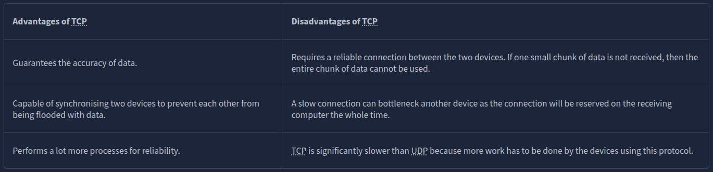

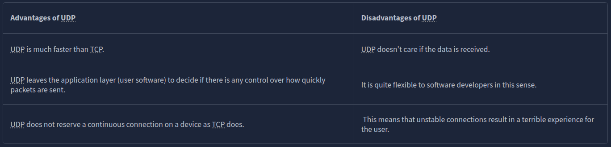

### Task 6 Layer 5 - Session

What is the name of this layer?
```
✅ Session
```

What is the technical term for when a connection is succesfully established?
```
✅ Session
```
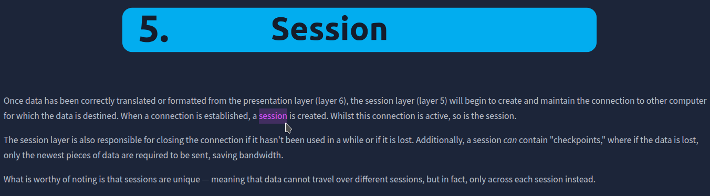

### Task 7 Layer 6 - Presentation

What is the name of this Layer?
``` 
✅ Presentation
```

What is the main purpose that this Layer acts as?
```
✅ Translator
```
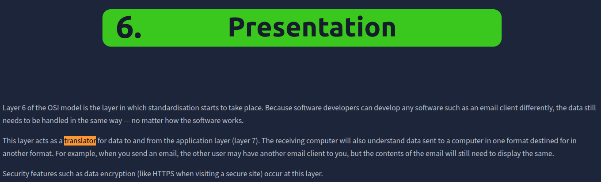

### Task 8 Layer 7 - Application

What is the name of this Layer?
```
✅ Application
```

What is the technical term that is given to the name of the software that users interact with?
```
✅ Graphical User Interface
```


### Task 9 Practical - OSI Game

Escape the dungeon to retrieve the flag. What is the flag?
```
✅ THM{OSI_DUNGEON_ESCAPED}
```
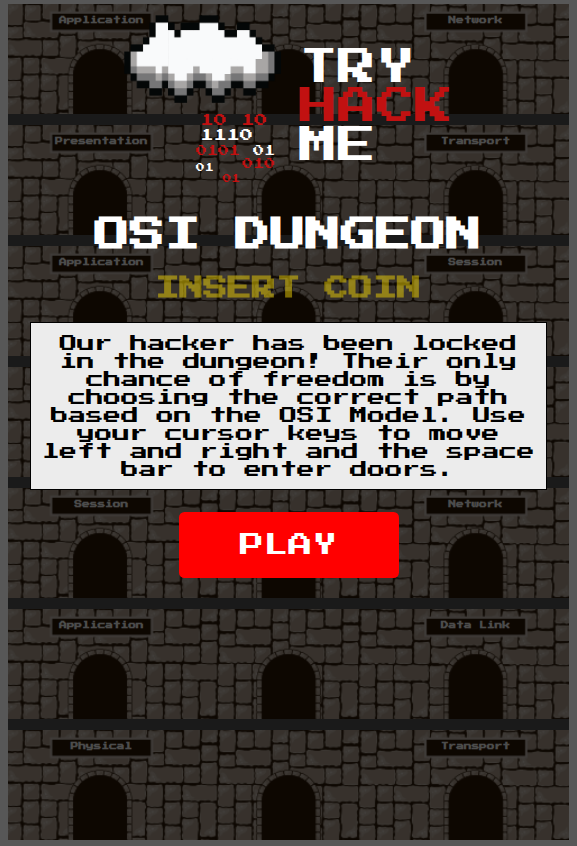

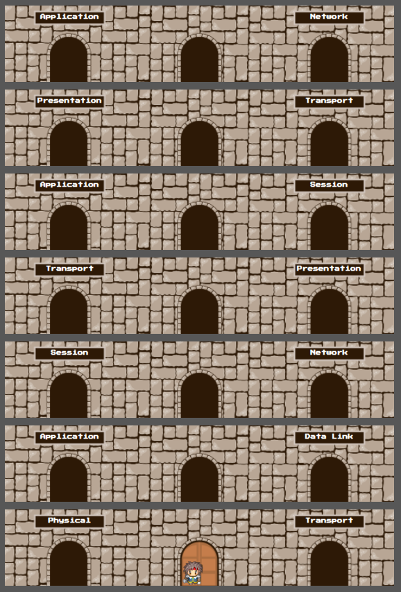

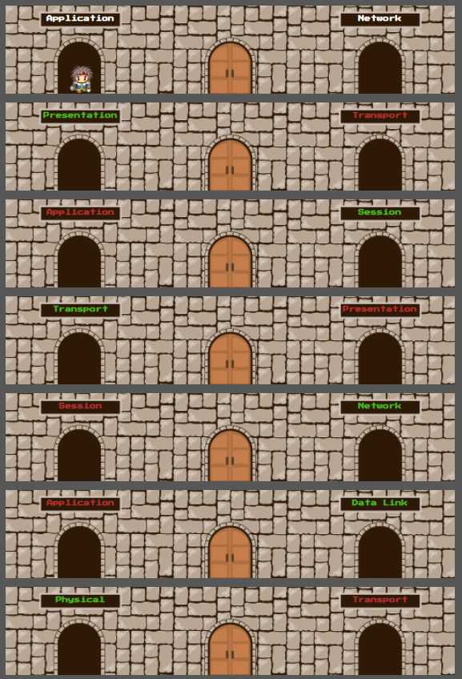

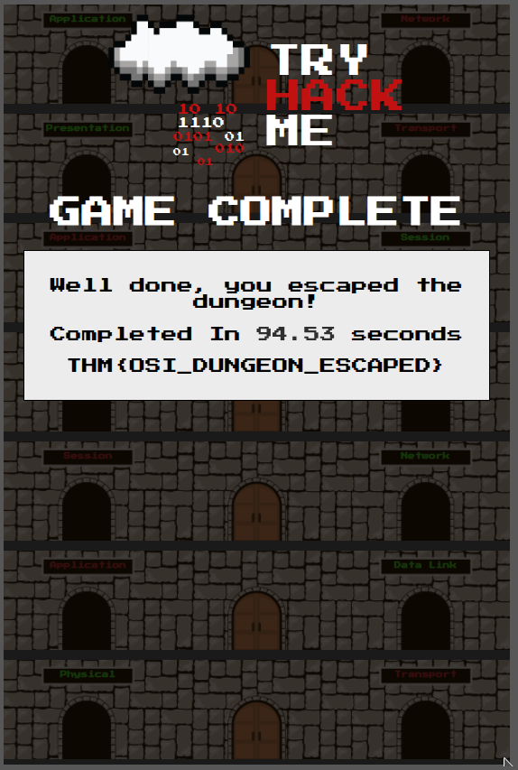

### Task 10 Continue Your Learning: Packets & Frames

Join the "Packets and Frames" room.
```
✅ No answer needed
```