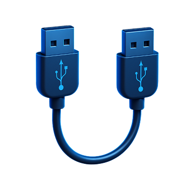

# Packets & Frames
Understand how data is divided into smaller pieces and transmitted across a network to another device


### Task 1 What are Packets and Frames

What is the name for a piece of data when it does have IP addressing information?
```
✅ Packet
```

What is the name for a piece of data when it does not have IP addressing information?
```
✅ Frame
```
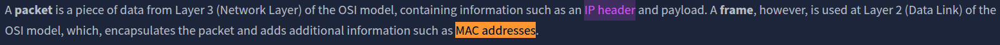

### Task 2 TCP/IP (The Three-Way Handshake)

What is the header in a TCP packet that ensures the integrity of data?
```
✅ checksum
```
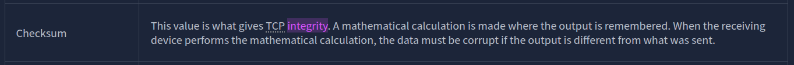

Provide the order of a normal Three-way handshake (with each step separated by a comma)
```
✅ SYN,SYN/ACK,ACK
```
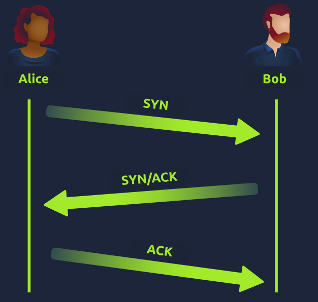

### Task 3 Practical - Handshake

What is the value of the flag given at the end of the conversation?
```
✅ THM{TCP_CHATTER}
```
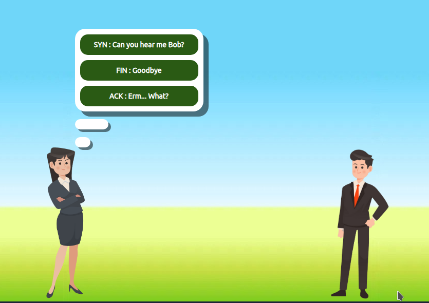

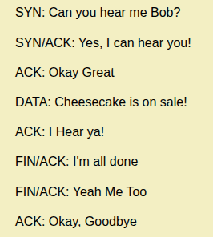

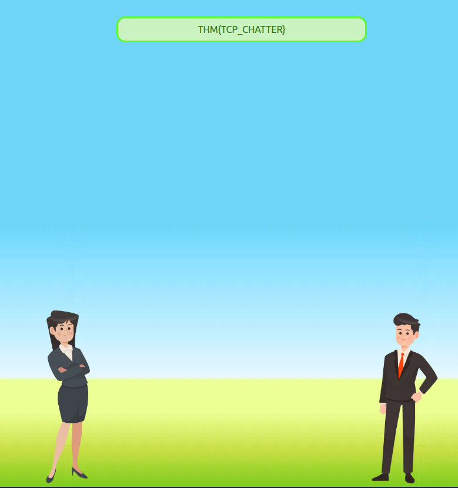

### Task 4 UDP/IP

What does the term "UDP" stand for?
```
✅ User Datagram Protocol
```

What type of connection is "UDP"?
```
✅ stateless
```
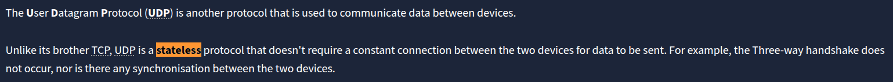

What protocol would you use to transfer a file?
```
✅ TCP
```

What protocol would you use to have a video call?
``` 
✅ UDP
```
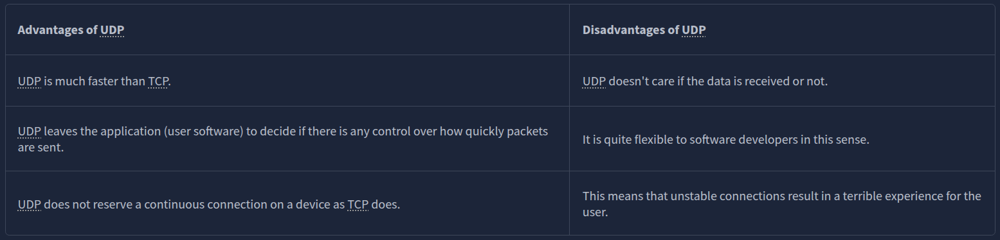

### Task 5 Ports 101 (Practical)

What is the flag received from the challenge?
```
✅ THM{YOU_CONNECTED_TO_A_PORT}
```
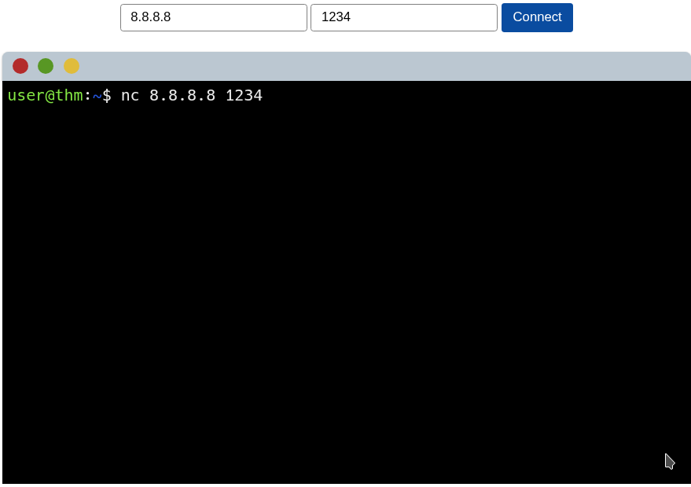
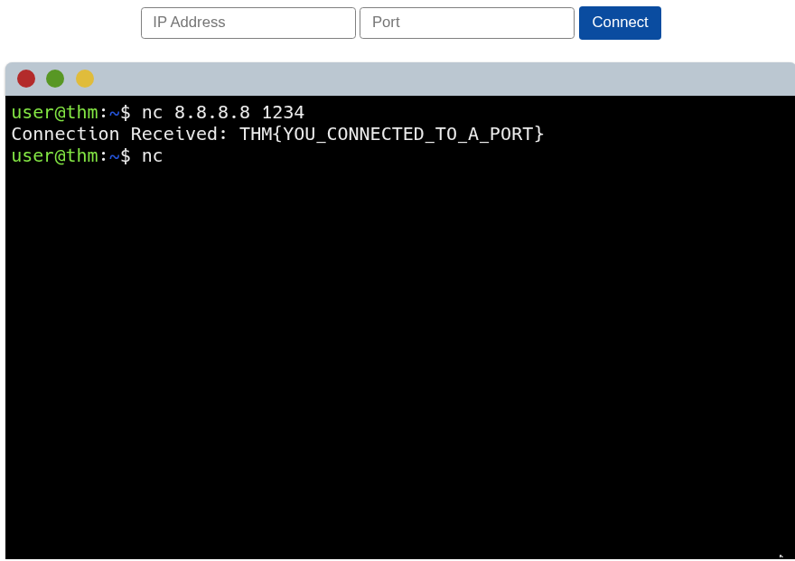

### Task 6 Continue Your Learning: Extending Your Network

Terminate the static site lab deployed in tasks 3 and 5.
```
✅ No answer needed
```

Join the "Extending Your Network" room to continue your learning.
```
✅ No answer needed
```


