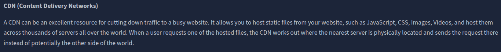
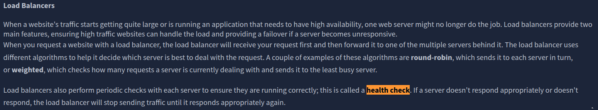
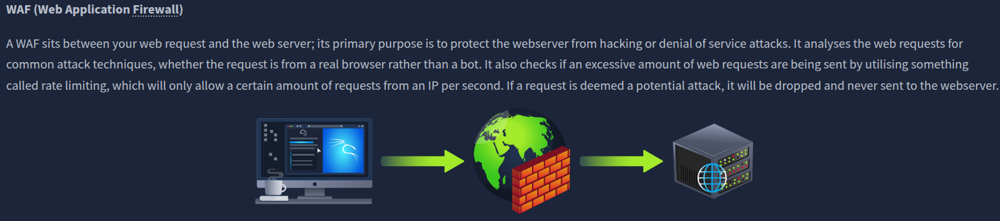
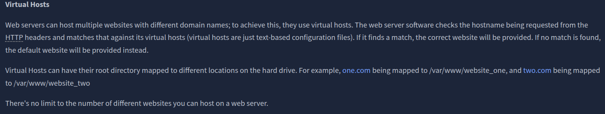
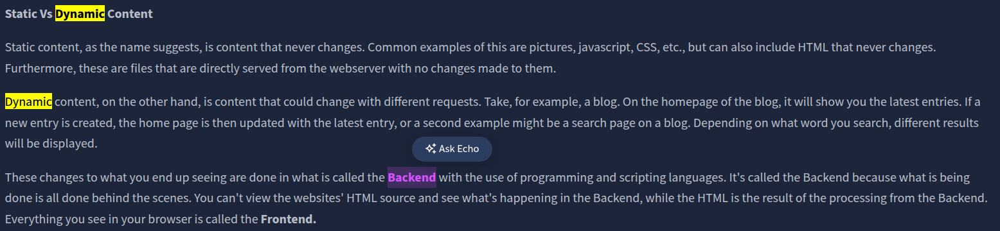
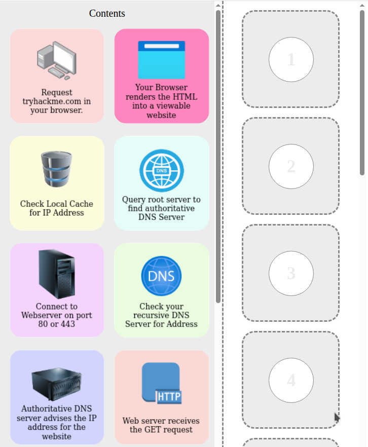
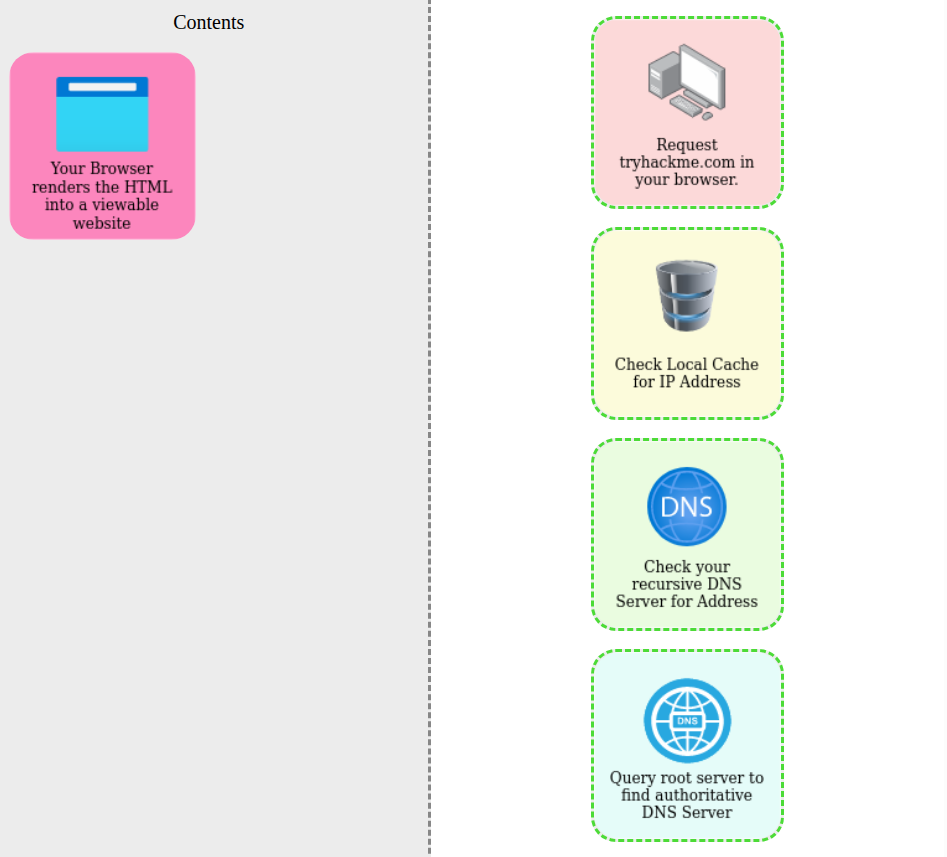
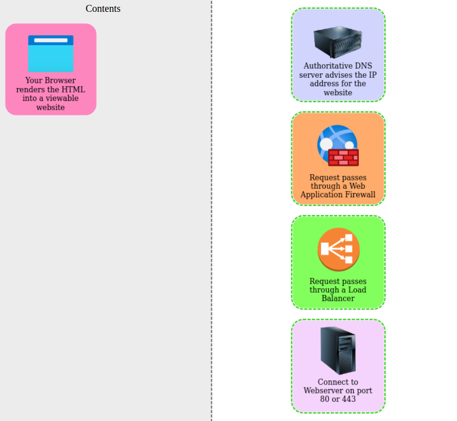
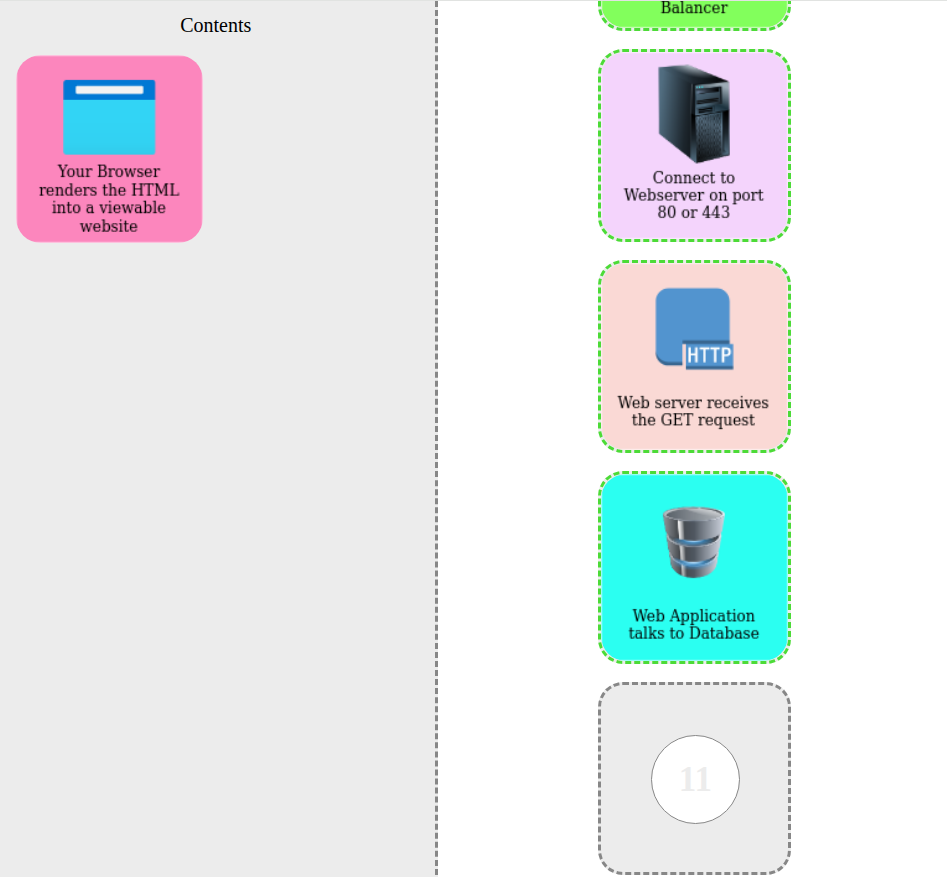
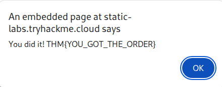

# Putting it all together
Learn how all the individual components of the web work together to bring you access to your favourite web sites.

### Task 1 Putting It All Together

I've read this...
```
✅ No answer needed
```

### Task 2 Other Components

What can be used to host static files and speed up a clients visit to a website?
```
✅ CDN
```


What does a load balancer perform to make sure a host is still alive?
```
✅ health check
```


What can be used to help against the hacking of a website?
```
✅ WAF
```


### Task 3 How Web Servers Work

What does web server software use to host multiple sites?
```
✅ Virtual Hosts
```


What is the name for the type of content that can change?
```
✅ Dynamic
```


Does the client see the backend code? Yay/Nay
```
✅ Nay
```

### Task 4 Quiz

Flag
```
✅ THM{YOU_GOT_THE_ORDER}
```






