# What is Networking?
Begin learning the fundamentals of computer networking in this bite-sized and interactive module.


### Task 1 What is Networking? 

What is the key term for devices that are connected together?
```
✅ Network
```
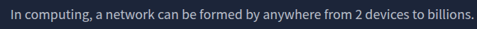

### Task 2 What is the Internet?

Who invented the World Wide Web?
```
✅ Tim Berners-Lee
```
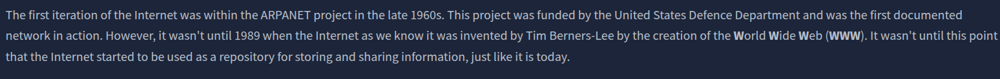

### Task 3 Identifying Devices on a Network

What does the term "IP" stand for?
```
✅ Internet Protocol
```
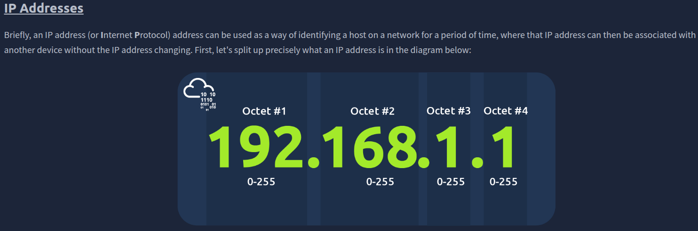

What is each section of an IP address called?
```
✅ Octet
```


How many sections (in digits) does an IPv4 address have? 
```
✅ 4
```

What does the term "MAC" stand for?
```
✅ Media Access Control
```
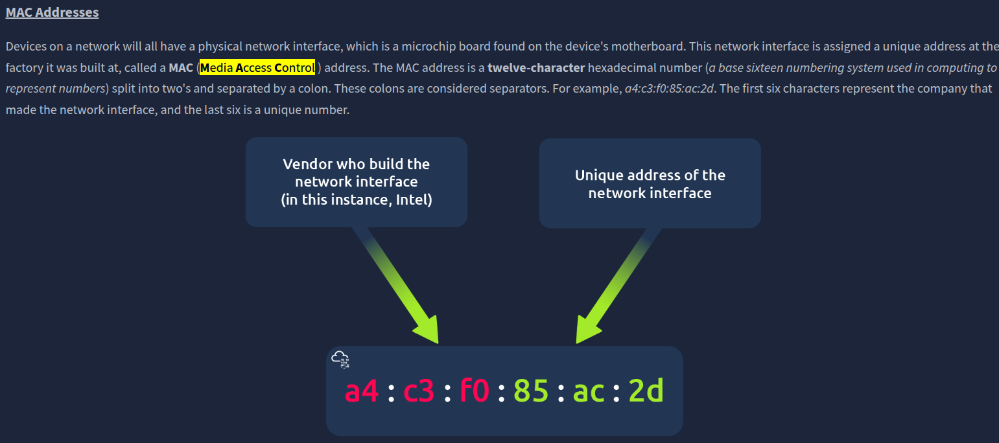

Deploy the interactive lab using the "View Site" button and spoof your MAC address to access the site.  What is the flag?
```
✅ THM{YOU_GOT_ON_TRYHACKME}
```
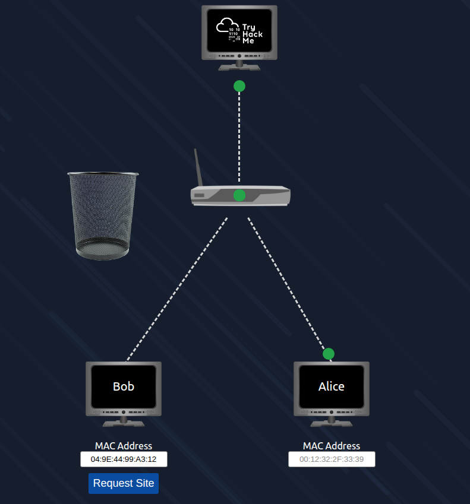  

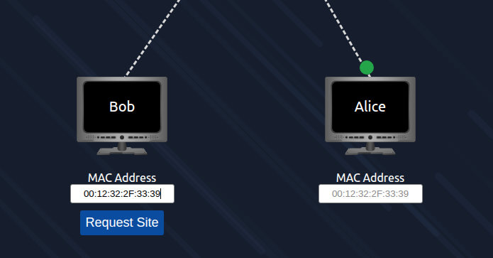

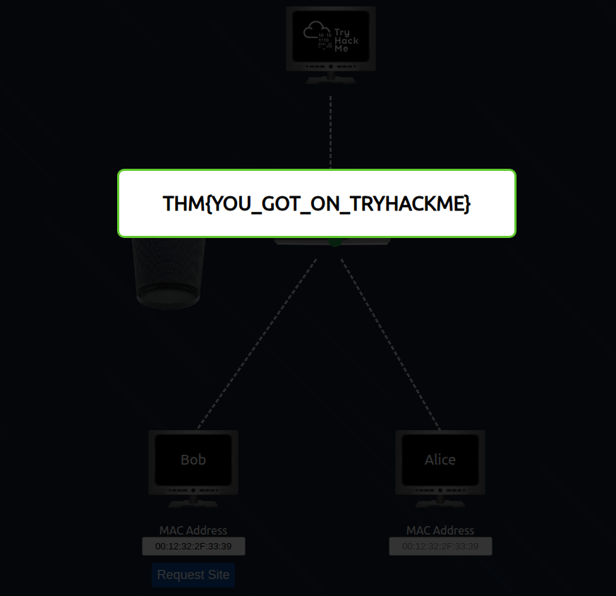

### Task 4 Ping (ICMP)

What protocol does ping use?
```
✅ ICMP
```
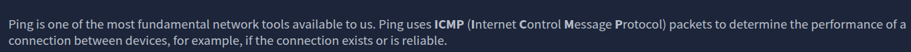

What is the syntax to ping 10.10.10.10?
```
✅ ping 10.10.10.10
```
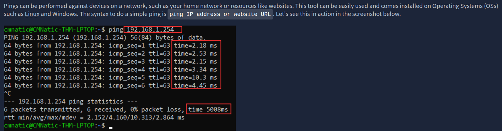

What flag do you get when you ping 8.8.8.8?
```
✅ THM{I_PINGED_THE_SERVER}
```
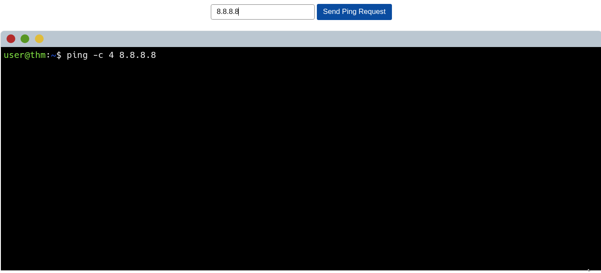

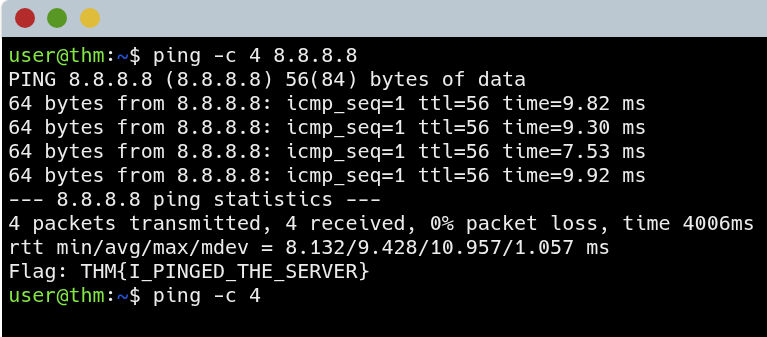

### Task 5 Continue Your Learning: Intro to LAN

Join the "Intro to LAN" room.
```
✅ No answer needed
```


