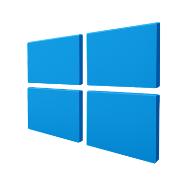

# Windows Fundamentals 1
In part 1 of the Windows Fundamentals module, we'll start our journey learning about the Windows desktop, the NTFS file system, UAC, the Control Panel, and more..

### Task 1 Windows Editions

What encryption can you enable on Pro that you can't enable in Home?
```
✅ BitLocker
```

### Task 2 The Desktop (GUI)

Which selection will hide/disable the Search box?
```
✅ Hidden
```

Which selection will hide/disable the Task View button?
```
✅ Show Task View button
```

Besides Clock and Network, what other icon is visible in the Notification Area?
```
✅ Action Center
```

### Task 3 Introduction to Windows

Read above and start the virtual machine.
```
✅ No answer needed
```

### Task 4 The File System

What is the meaning of NTFS?
```
✅ New Technology File System
```

### Task 5 The Windows\System32 Folders

What is the system variable for the Windows folder?
```
✅ %windir%
```

### Task 6 User Accounts, Profiles, and Permissions

What is the name of the other user account?
```
✅ tryhackmebilly
```

What groups is this user a member of?
```
✅ Remote Desktop Users,Users
```

What built-in account is for guest access to the computer?
```
✅ Guest
```

What is the account description?
```
✅ window$Fun1!
```

### Task 7 User Account Control

What does UAC mean?
```
✅ User Account Control
```

### Task 8 Settings and the Control Panel

In the Control Panel, change the view to Small icons. What is the last setting in the Control Panel view?
```
✅ Windows Defender Firewall
```

### Task 9 Task Manager

What is the keyboard shortcut to open Task Manager?
```
✅ Ctrl+Shift+Esc
```

### Task 10 Conclusion

Read above and terminate the Windows machine you deployed in this room.
```
✅ No answer needed
```

