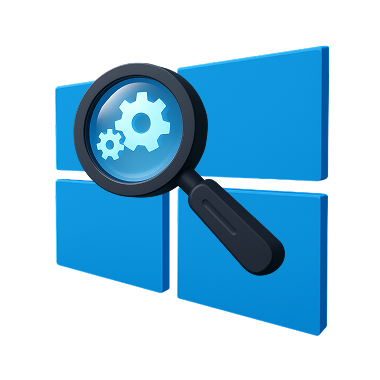

# Windows Fundamentals 3
In part 3 of the Windows Fundamentals module, learn about the built-in Microsoft tools that help keep the device secure, such as Windows Updates, Windows Security, BitLocker, and more...

### Task 1 Introduction

Read the above and start the virtual machine.
```
✅ No answer needed
```

### Task 2 Windows Updates

There were two definition updates installed in the attached VM. On what date were these updates installed?
```
✅ 5/3/2021
```

### Task 3 Windows Security

Checking the Security section on your VM, which area needs immediate attention?
```
✅ Virus & threat protection
```

### Task 4 Virus & threat protection

Specifically, what is turned off that Windows is notifying you to turn on?
```
✅ Real-time protection
```

### Task 5 Firewall & network protection

If you were connected to airport Wi-Fi, what most likely will be the active firewall profile?
```
✅ Public network
```

### Task 6 App & browser control

Read the above.
```
✅ No answer needed
```

### Task 7 Device security

What is the TPM?
```
✅ Trusted Platform Module
```

### Task 8 BitLocker

We should use a removable drive on systems without a TPM version 1.2 or later. What does this removable drive contain?
```
✅ startup key
```

### Task 9 Volume Shadow Copy Service

What is VSS?
```
✅ Volume Shadow Copy Service
```

### Task 10 Conclusion

Read the above.
```
✅ No answer needed
```


